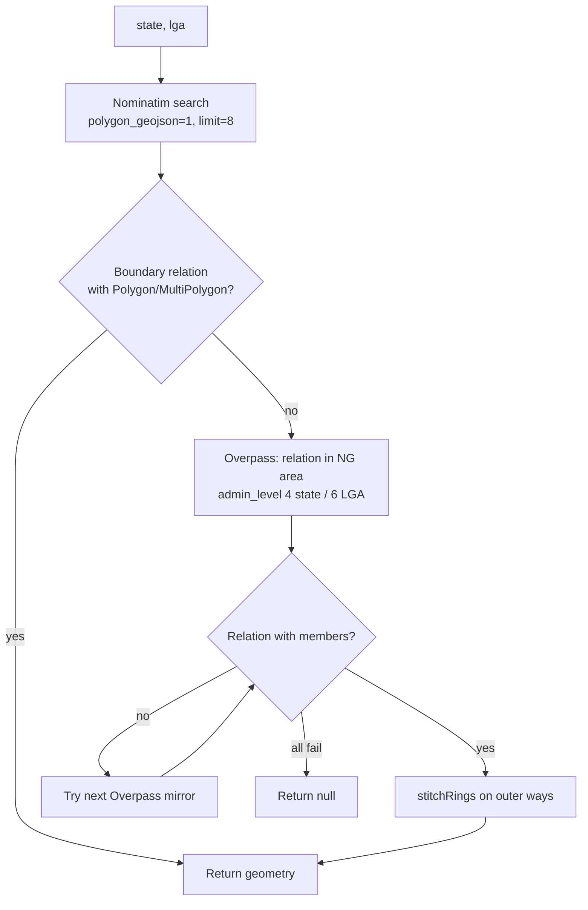

# API Reference

[← Documentation index](../README.md#documentation)

## Table of Contents

- [Overview](#overview)
- [Transport model](#transport-model)
- [Healthcare data group](#healthcare-data-group)
  - [runOverpass](#runoverpass)
- [Administrative boundary group](#administrative-boundary-group)
  - [getAdminBoundary](#getadminboundary)
- [Client-side data functions](#client-side-data-functions)
  - [findNearestFacilities](#findnearestfacilities)
  - [fetchOsrmRoute](#fetchosrmroute)
- [External APIs consumed](#external-apis-consumed)
- [Error model](#error-model)
- [Rate limits and quotas](#rate-limits-and-quotas)
- [Adding a new endpoint](#adding-a-new-endpoint)

## Overview

The application exposes **no public REST API**. Its server surface consists of two typed TanStack Start server functions invoked over RPC from the browser. There are no HTTP routes under `src/routes/api/`, no webhooks and no authentication.

| Group | Function | Method | File |
| --- | --- | --- | --- |
| Healthcare data | `runOverpass` | POST | `src/lib/overpass.functions.ts` |
| Administrative boundary | `getAdminBoundary` | POST | `src/lib/admin-boundary.functions.ts` |

Two additional data functions run entirely in the browser and are documented here because they define the emergency-response contract: `findNearestFacilities` and `fetchOsrmRoute` (`src/lib/nearest.ts`).

## Transport model

Server functions are typed RPC, not hand-written HTTP endpoints. Call them as functions:

```ts
import { runOverpass } from "@/lib/overpass.functions";

const res = await runOverpass({ data: { query: "[out:json];node[amenity=hospital](7.3,3.8,7.5,4.0);out;" } });
```

TanStack Start serialises the call to an internal `POST` against a generated URL, validates the payload with the function's Zod validator, runs the handler in the worker runtime, and returns the deserialised result. Payloads are JSON; failures surface as thrown `Error`s on the client.

---

## Healthcare data group

### runOverpass

Executes an arbitrary Overpass QL query against a failover chain of public Overpass mirrors.

| Field | Value |
| --- | --- |
| **Function** | `runOverpass` |
| **File** | `src/lib/overpass.functions.ts` |
| **Method** | `POST` |
| **Auth** | None (public) |
| **Timeout** | 60 s per endpoint (`AbortController`) |

#### Request body

| Field | Type | Required | Constraints | Description |
| --- | --- | --- | --- | --- |
| `query` | `string` | Yes | 1–20,000 chars | Complete Overpass QL query including the `[out:json]` header |

Zod schema:

```ts
z.object({ query: z.string().min(1).max(20000) })
```

There are no path or query parameters.

#### Response

| Field | Type | Description |
| --- | --- | --- |
| `elements` | `OverpassElement[]` | Raw Overpass elements (empty array when the query matches nothing) |
| `source` | `string` | The mirror URL that successfully served the request |

`OverpassElement` (`src/lib/oyo.ts`):

```ts
type OverpassElement = {
  type: "node" | "way" | "relation";
  id: number;
  lat?: number;
  lon?: number;
  center?: { lat: number; lon: number };
  geometry?: { lat: number; lon: number }[];
  tags?: Record<string, string>;
};
```

#### Example request

```ts
const body = `[out:json][timeout:45];
(
  nwr["amenity"="hospital"](7.30,3.80,7.50,4.05);
  nwr["healthcare"="hospital"](7.30,3.80,7.50,4.05);
);
out center tags;`;

const { elements, source } = await runOverpass({ data: { query: body } });
```

#### Example response

```json
{
  "elements": [
    {
      "type": "node",
      "id": 1234567890,
      "lat": 7.3878,
      "lon": 3.8964,
      "tags": {
        "amenity": "hospital",
        "name": "University College Hospital",
        "operator": "Federal Ministry of Health",
        "emergency": "yes"
      }
    }
  ],
  "source": "https://overpass-api.de/api/interpreter"
}
```

#### Behaviour and status handling

| Condition | Handling |
| --- | --- |
| Mirror returns non-2xx | Recorded as `"<url> → <status>"`, next mirror tried |
| Mirror returns HTML with HTTP 200 (rate-limit/timeout page) | Detected by a leading `<`, recorded as `non-json response`, next mirror tried |
| Request exceeds 60 s | Aborted, next mirror tried |
| Network/DNS failure | Message recorded, next mirror tried |
| All four mirrors fail | Throws `Error("All Overpass endpoints failed: <lastError>")` |
| Validation failure | Zod throws before the handler runs |

#### Error responses

```text
Error: All Overpass endpoints failed: https://overpass.private.coffee/api/interpreter → 429
```

Client-side, TanStack Query retries three times with exponential backoff capped at 20 s before surfacing the error to the UI.

---

## Administrative boundary group

### getAdminBoundary

Resolves a Nigerian State (and optional LGA) to a real administrative polygon.

| Field | Value |
| --- | --- |
| **Function** | `getAdminBoundary` |
| **File** | `src/lib/admin-boundary.functions.ts` (handler in `admin-boundary.server.ts`) |
| **Method** | `POST` |
| **Auth** | None (public) |

#### Request body

| Field | Type | Required | Constraints | Description |
| --- | --- | --- | --- | --- |
| `state` | `string` | Yes | 1–80 chars | State name, e.g. `"Oyo"` |
| `lga` | `string \| null` | Yes | 1–120 chars or `null` | LGA name, or `null` for the whole state |

```ts
z.object({
  state: z.string().min(1).max(80),
  lga: z.string().min(1).max(120).nullable(),
})
```

#### Response

A GeoJSON `Polygon` or `MultiPolygon` (or `null` when no boundary can be resolved), consumed by `studyAreaFromCollection()` to build the `StudyArea`.

```ts
type StudyArea = {
  state: string;
  name: string;
  bbox: BBox;             // { south, west, north, east }
  rings: Position[][];    // outer rings for point-in-polygon tests
};
```

#### Resolution strategy



Admin levels: `4` = state, `6` = LGA. The Overpass query is scoped by `area["ISO3166-1"="NG"][admin_level=2]` and matches the name case-insensitively with regex metacharacters escaped.

#### Example request

```ts
const boundary = await getAdminBoundary({ data: { state: "Oyo", lga: "Ibadan North" } });
```

#### Example response (truncated)

```json
{
  "type": "Polygon",
  "coordinates": [[[3.8901, 7.4123], [3.9214, 7.4188], [3.9330, 7.3902], [3.8901, 7.4123]]]
}
```

#### Error responses

| Condition | Result |
| --- | --- |
| Nominatim non-2xx | Falls through to Overpass |
| No Overpass relation on any mirror | Returns `null`; the UI keeps the previous view and shows a toast |
| Malformed ring geometry | Unstitchable segments are dropped; if none remain, returns `null` |
| Validation failure | Zod throws before the handler runs |

---

## Client-side data functions

### findNearestFacilities

```ts
findNearestFacilities(lat: number, lng: number, signal?: AbortSignal):
  Promise<{ results: NearestResults; radiusUsed: number; total: number }>
```

| Aspect | Detail |
| --- | --- |
| Source | `src/lib/nearest.ts` |
| Transport | Calls `runOverpass` per radius |
| Radii | 5,000 → 10,000 → 25,000 → 50,000 m, stopping early once all four categories are found |
| Categories | `hospital`, `clinic`, `pharmacy`, `ambulance` |
| Classification | `emergency=ambulance_station`; `amenity`/`healthcare` in `hospital \| clinic \| pharmacy`; `healthcare=centre/center` → clinic |
| Distance | Haversine great-circle, kilometres |
| Cancellation | Honours `AbortSignal`; throws `AbortError` |

Overpass query per radius:

```text
[out:json][timeout:30];(
  nwr["amenity"~"^(hospital|clinic|pharmacy)$"](around:R,LAT,LNG);
  nwr["healthcare"~"^(hospital|clinic|pharmacy|centre|center)$"](around:R,LAT,LNG);
  nwr["emergency"="ambulance_station"](around:R,LAT,LNG);
);out center tags;
```

Example result:

```json
{
  "results": {
    "hospital": { "category": "hospital", "coords": [7.3878, 3.8964], "distanceKm": 2.41, "element": { "...": "..." } },
    "pharmacy": { "category": "pharmacy", "coords": [7.3799, 3.9012], "distanceKm": 0.88, "element": { "...": "..." } }
  },
  "radiusUsed": 10000,
  "total": 143
}
```

### fetchOsrmRoute

```ts
fetchOsrmRoute(
  from: [number, number],
  to: [number, number],
  mode?: "driving" | "walking" | "cycling",
  signal?: AbortSignal,
  opts?: { alternatives?: boolean; preference?: "fastest" | "shortest" }
): Promise<RouteResult & { alternatives: RouteResult[] }>
```

| Aspect | Detail |
| --- | --- |
| Endpoint | `GET https://router.project-osrm.org/route/v1/{profile}/{fromLng},{fromLat};{toLng},{toLat}` |
| Profiles | `driving`, `foot` (walking), `bike` (cycling) |
| Query params | `overview=full`, `geometries=geojson`, `steps=true`, `alternatives=<bool>`, `annotations=false` |
| Returns | Polyline coordinates, distance (km), duration (min), humanised turn-by-turn steps |
| Errors | Throws `Error("OSRM <status>")` on non-2xx; aborts honour the signal |

Coordinate order is **lng,lat** in the URL and **[lat,lng]** in application code — a frequent source of bugs.

Example:

```ts
const route = await fetchOsrmRoute([7.3775, 3.9470], [7.3878, 3.8964], "driving", undefined, {
  alternatives: true,
  preference: "fastest",
});
// route.distanceKm, route.durationMin, route.coords, route.steps
```

Status codes returned by OSRM: `200 Ok`, `400 InvalidQuery`, `429 TooManyRequests`, `500` server error. `NoRoute` is returned with HTTP 200 and an empty `routes` array — treat as "unroutable".

---

## External APIs consumed

| Service | Endpoint | Called from | Auth | Notes |
| --- | --- | --- | --- | --- |
| Overpass API | `POST /api/interpreter` on 4 mirrors | Server function | None | Body `data=<urlencoded QL>` |
| Nominatim | `GET /search?format=json&polygon_geojson=1` | Server function | None | 1 req/s policy; descriptive UA required |
| OSRM | `GET /route/v1/{profile}/...` | Browser | None | Public demo server is rate limited |
| OSM tiles | `tile.openstreetmap.org`, `tile.openstreetmap.fr/hot` | Browser | None | Attribution mandatory |
| CARTO tiles | `{s}.basemaps.cartocdn.com/{light,dark}_all` | Browser | None | Attribution mandatory |
| Esri imagery | `server.arcgisonline.com/.../World_Imagery` | Browser | None | Esri attribution mandatory |
| osm.org / iD / JOSM | Deep links only | Browser | None | JOSM uses `127.0.0.1:8111` remote control |

Full integration notes, fallbacks and etiquette: [osm-integration.md](./osm-integration.md).

## Error model

| Layer | Failure | Surfaced as |
| --- | --- | --- |
| Validation | Zod parse error | Thrown before handler execution |
| Overpass | All mirrors exhausted | `Error("All Overpass endpoints failed: …")` |
| Boundary | No polygon found | `null` result, toast notification |
| OSRM | Non-2xx | `Error("OSRM <status>")` |
| OSRM | No route | Empty `routes[]`, UI reports "no route found" |
| Query layer | 3 retries exhausted | `isError` on the query; panel shows a retry affordance |
| Render | Uncaught error | Root `errorComponent` in `src/routes/__root.tsx` |

## Rate limits and quotas

| Service | Practical limit | Mitigation in code |
| --- | --- | --- |
| Overpass (public) | ~2 concurrent slots, fair-use CPU quota per IP | Four-mirror failover, bundled single query per study area, 30-min cache, zoom/area gates |
| Nominatim | 1 request/second, no bulk use | Only called on explicit area selection |
| OSRM demo | Undocumented, low | Routing only on explicit user action |
| Tile CDNs | Fair use | Browser tile cache, `maxZoom` per provider |

## Adding a new endpoint

1. Create `src/lib/<feature>.functions.ts` containing **only** imports, types and the exported `createServerFn` declaration.
2. Put the implementation in `src/lib/<feature>.server.ts` (the `.server` suffix keeps it out of the client bundle).
3. Validate every input with Zod using tight bounds.
4. Read secrets and configuration with `process.env['X']` **inside** `.handler()`.
5. Add failover and an `AbortController` timeout for any outbound call.
6. Document the function in this file: request, response, examples, errors.
7. Add a `CHANGELOG.md` entry.

For raw HTTP (webhooks, cron), create a server route under `src/routes/api/public/` and verify the caller inside the handler — see [backend.md](./backend.md#http-routes).
