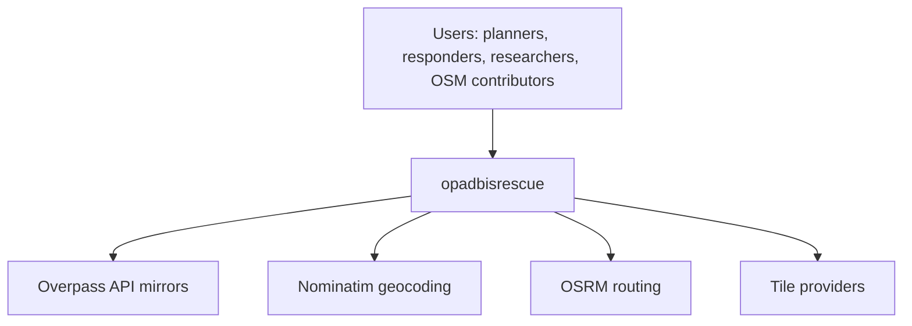
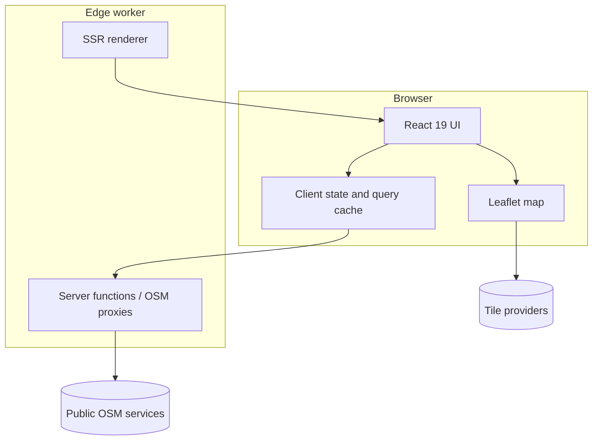
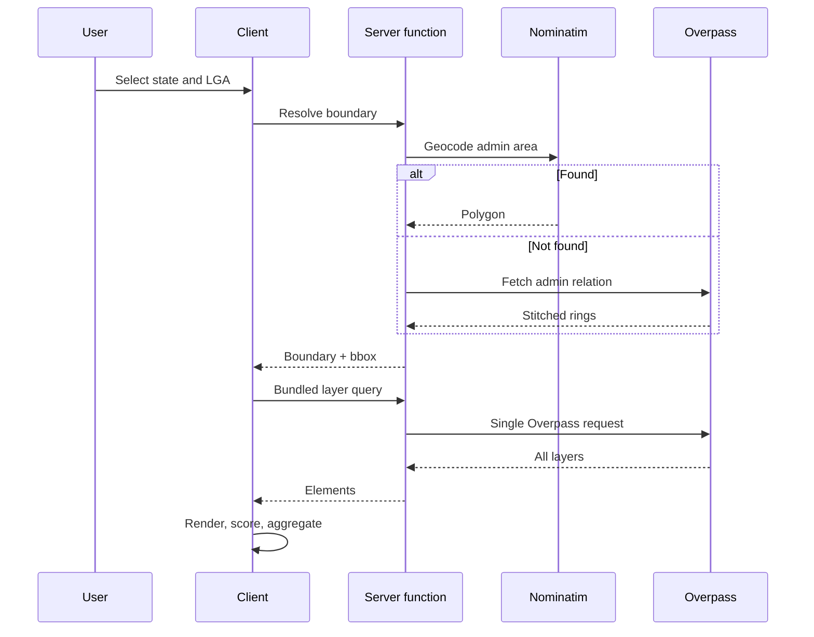
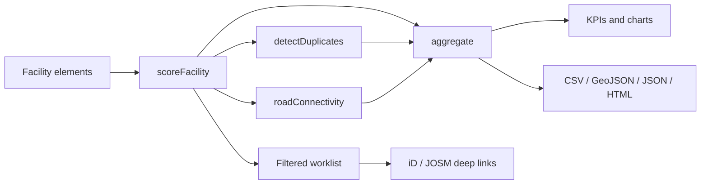
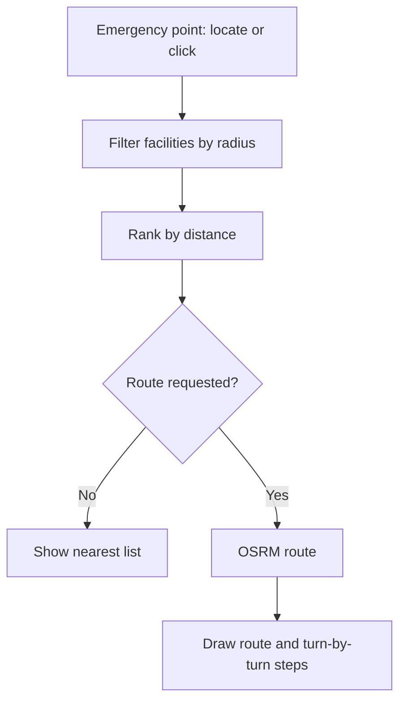
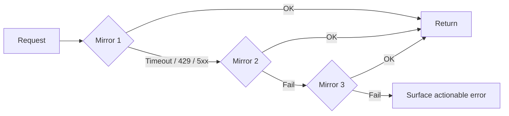
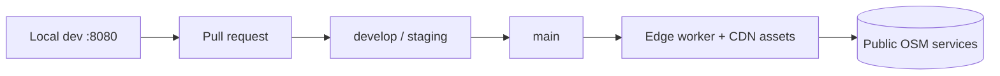

# Architecture Diagrams

[← Documentation index](../README.md#documentation)

Consolidated diagram reference. Narrative context lives in [system-architecture.md](./system-architecture.md).

## System context

## Container view

## Study-area data flow

## Quality analysis pipeline

## Emergency response flow

## Resilience: mirror failover

## Deployment topology

