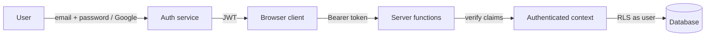
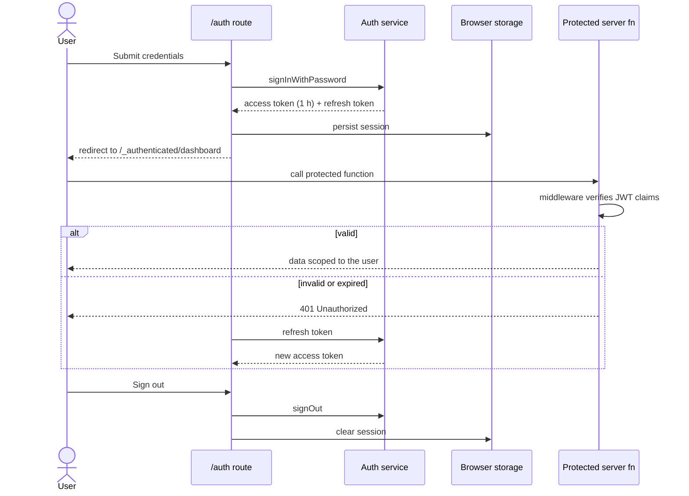

# Authentication & Authorisation

[← Documentation index](../README.md#documentation)

## Table of Contents

- [Current status](#current-status)
- [Why the application is unauthenticated](#why-the-application-is-unauthenticated)
- [What this means in practice](#what-this-means-in-practice)
- [Current protections](#current-protections)
- [Adding authentication in future](#adding-authentication-in-future)
- [Proposed session flow](#proposed-session-flow)
- [Proposed protected routes](#proposed-protected-routes)
- [Proposed role validation](#proposed-role-validation)
- [Token lifecycle](#token-lifecycle)
- [Migration checklist](#migration-checklist)

## Current status

> **Authentication is not implemented. The application currently provides fully public, anonymous access.**

There are no accounts, no login, no logout, no sessions, no tokens, no cookies used for identity, and no protected routes. Every visitor sees identical functionality:

| Capability | Available to anonymous visitors |
| --- | --- |
| View both dashboards | Yes |
| Select any state or LGA | Yes |
| Query live OSM data | Yes |
| Run accessibility and routing analysis | Yes |
| Run quality analysis | Yes |
| Export CSV / GeoJSON / JSON / HTML | Yes |
| Deep-link into iD / JOSM | Yes |
| Modify application data | Not applicable — the application stores nothing |

Both routes (`/` and `/quality`) are public. Both server functions (`runOverpass`, `getAdminBoundary`) are unauthenticated and callable by anyone who can reach the deployment.

## Why the application is unauthenticated

1. **All data is already public.** Every byte displayed originates from OpenStreetMap, which is open by licence. Gating it would add friction without adding protection.
2. **Nothing is written.** The application has no database and no mutable server state, so there is no integrity boundary to defend with identity.
3. **No personal data is processed.** Geolocation stays in browser memory and is never transmitted to the application server.
4. **Public-good access.** Emergency and planning information should be reachable without an account, especially on constrained connections.
5. **Operational simplicity.** No user store means no credential breach surface, no password reset flow, and no compliance burden.

## What this means in practice

**Implications you must accept when deploying as-is:**

- Anyone who reaches the deployment can drive Overpass and Nominatim traffic through your infrastructure and User-Agent.
- You cannot attribute usage to individuals or enforce per-user quotas.
- You cannot offer saved workspaces, personal exports, or audit trails.
- Any abuse mitigation must be network-level (WAF, IP rate limiting, Turnstile-style challenge) rather than identity-level.

Recommended compensating controls are documented in [security.md](./security.md#public-access-hardening).

## Current protections

Even without authentication, the server surface is deliberately narrow:

| Control | Implementation |
| --- | --- |
| Input validation | Zod schemas bound every server-function input (`query` ≤ 20,000 chars; `state` ≤ 80; `lga` ≤ 120) |
| No arbitrary egress | `runOverpass` posts only to a hardcoded mirror allowlist — a caller cannot make the server fetch an arbitrary URL |
| Request timeout | 60 s `AbortController` per Overpass attempt |
| No secrets in the bundle | No API keys exist; `VITE_*` values are non-sensitive by design |
| No write paths | No mutation endpoints exist to abuse |
| Read-only OSM interaction | Edits happen in the user's own OSM session inside iD/JOSM, never through this application |

## Adding authentication in future

Authentication becomes necessary the moment any of these features are built: saved study areas, scheduled quality reports, contributor leaderboards, per-organisation quotas, or an administrative configuration UI.

Recommended approach: **Lovable Cloud (managed Supabase) authentication** with email/password plus managed Google sign-in.



Implementation outline:

1. Enable Lovable Cloud, which provisions the auth service and database.
2. Add an `/auth` route with sign-in, sign-up and password reset.
3. Create an `_authenticated/` route subtree whose `route.tsx` gate redirects unauthenticated visitors to `/auth` before any loader runs.
4. Add a `requireSupabaseAuth` middleware to server functions that must be protected.
5. Add client-side function middleware in `src/start.ts` to attach the bearer token to server-function calls.
6. Store roles in a dedicated `user_roles` table — **never** on a profile row — and check them with a `SECURITY DEFINER` `has_role()` function.

## Proposed session flow



## Proposed protected routes

| Route | Access today | Proposed access |
| --- | --- | --- |
| `/` | Public | Public — keep open |
| `/quality` | Public | Public — keep open |
| `/auth` | — | Public (anonymous only) |
| `/_authenticated/workspaces` | — | Authenticated: saved study areas |
| `/_authenticated/reports` | — | Authenticated: scheduled reports |
| `/_authenticated/admin` | — | Administrator role only |

Rule: a protected server function must never be called from a public route's `loader` — SSR and prerender have no session and the call will 401. Call it from the component via `useServerFn` inside `useQuery`, or place the route under the `_authenticated/` gate.

## Proposed role validation

```sql
create type public.app_role as enum ('admin', 'analyst', 'contributor', 'viewer');

create table public.user_roles (
  id uuid primary key default gen_random_uuid(),
  user_id uuid references auth.users(id) on delete cascade not null,
  role app_role not null,
  unique (user_id, role)
);

grant select on public.user_roles to authenticated;
grant all on public.user_roles to service_role;

alter table public.user_roles enable row level security;

create or replace function public.has_role(_user_id uuid, _role app_role)
returns boolean
language sql
stable
security definer
set search_path = public
as $$
  select exists (
    select 1 from public.user_roles
    where user_id = _user_id and role = _role
  )
$$;

create policy "Users read own roles"
  on public.user_roles for select to authenticated
  using (user_id = auth.uid());
```

Never derive administrator status from `localStorage`, a client flag, or a hardcoded email list — those are trivially forged. Always verify server-side against `user_roles`.

Role definitions and intended permissions: [user-roles.md](./user-roles.md).

## Token lifecycle

Applicable only after authentication is added:

| Stage | Behaviour |
| --- | --- |
| Issue | Access JWT on successful sign-in, ~1 hour lifetime |
| Storage | Managed by the auth client; do not hand-roll storage |
| Attach | Client function middleware adds `Authorization: Bearer <token>` to protected calls |
| Verify | Server middleware validates signature, expiry and claims per request |
| Refresh | Refresh token rotates the access token transparently before expiry |
| Revoke | Sign-out clears the local session and revokes the refresh token |
| Expire | Expired access token yields 401; the client refreshes once, then redirects to `/auth` |

## Migration checklist

- [ ] Enable Lovable Cloud and confirm the generated client integration.
- [ ] Build the `/auth` route with sign-in, sign-up and reset.
- [ ] Add the `_authenticated/` gate route rendering `<Outlet />`.
- [ ] Add `requireSupabaseAuth` middleware to protected server functions.
- [ ] Keep `runOverpass` and `getAdminBoundary` public so the core dashboards remain open.
- [ ] Create `user_roles` plus the `has_role()` security-definer function.
- [ ] Enable RLS with explicit `GRANT`s on every new public-schema table.
- [ ] Add rate limiting keyed by user for authenticated OSM-heavy operations.
- [ ] Update [security.md](./security.md), [user-roles.md](./user-roles.md), [database.md](./database.md) and `CHANGELOG.md`.
