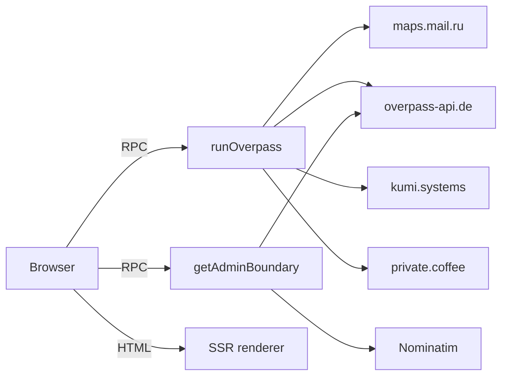

# Backend Architecture

[← Documentation index](../README.md#documentation)

## Table of Contents

- [Overview](#overview)
- [Runtime environment](#runtime-environment)
- [Server functions](#server-functions)
- [Overpass proxy](#overpass-proxy)
- [Administrative boundary resolution](#administrative-boundary-resolution)
- [Module boundary rules](#module-boundary-rules)
- [Environment variables in handlers](#environment-variables-in-handlers)
- [HTTP routes](#http-routes)
- [Error handling](#error-handling)
- [Observability](#observability)
- [Scaling characteristics](#scaling-characteristics)
- [Extending the backend](#extending-the-backend)

## Overview

The backend is intentionally minimal: **an SSR renderer plus two typed server functions that proxy OpenStreetMap services.** There is no database, no ORM, no queue, no cron, no authentication and no persistent state.



Why a server layer exists at all:

1. **Rate-limit stewardship** — one identifiable `User-Agent` and a controlled egress point instead of every browser hitting Overpass directly.
2. **Mirror failover** — retry logic across four instances that a browser client cannot express as cleanly.
3. **Response sanitation** — Overpass mirrors return HTML error pages with HTTP 200 under load; detecting that server-side prevents JSON parse errors from surfacing as UI crashes.
4. **Policy compliance** — OSM services expect a descriptive User-Agent, which browsers do not permit setting.

## Runtime environment

The backend runs in a **serverless edge worker** (Cloudflare Workers compatible) with `nodejs_compat`.

**Available:** `fetch`, `crypto`, `Buffer`, `stream`, `path`, `url`, `events`, `timers`, `zlib`, `AbortController`, virtual `fs`.

**Not available — do not use:**

| API | Consequence |
| --- | --- |
| `child_process` | Throws `[unenv] spawn is not implemented yet!` |
| `sharp`, `canvas`, `puppeteer` | Require native binaries |
| `fs.watch` | Unsupported |
| `os.cpus()`, `os.networkInterfaces()` | Partially stubbed |
| Any package needing a real OS filesystem or node-gyp build | Bundling or runtime failure |

Symptoms that indicate a Node-only dependency rather than a logic bug: `[unenv] X is not implemented yet!`, `__dirname is not defined`, `Cannot find module 'X'` at runtime, or code that works in `dev` but fails in a production build. The remedy is to swap the library for a Worker-compatible or pure-JS one — never to shim globals.

All npm packages are bundled at build time; there is no runtime module resolution. Never set `ssr.external` or `resolve.external` for the worker SSR environment.

## Server functions

| Function | File | Method | Validated input | Output |
| --- | --- | --- | --- | --- |
| `runOverpass` | `src/lib/overpass.functions.ts` | POST | `{ query: string(1..20000) }` | `{ elements: OverpassElement[]; source: string }` |
| `getAdminBoundary` | `src/lib/admin-boundary.functions.ts` | POST | `{ state: string(1..80); lga: string(1..120) \| null }` | `Polygon \| MultiPolygon \| null` |

Canonical shape:

```ts
import { createServerFn } from "@tanstack/react-start";
import { z } from "zod";
import { fetchAdminBoundary } from "./admin-boundary.server";

export const getAdminBoundary = createServerFn({ method: "POST" })
  .inputValidator((data) =>
    z.object({
      state: z.string().min(1).max(80),
      lga: z.string().min(1).max(120).nullable(),
    }).parse(data),
  )
  .handler(async ({ data }) => fetchAdminBoundary(data.state, data.lga));
```

Import `createServerFn` from `@tanstack/react-start` — importing from `@tanstack/start` or `@tanstack/react-router` produces "createServerFn is not a function".

Full request/response documentation: [api-reference.md](./api-reference.md).

## Overpass proxy

`runOverpass` iterates a hardcoded mirror list and returns the first usable JSON response.

```ts
const endpoints = [
  "https://maps.mail.ru/osm/tools/overpass/api/interpreter",
  "https://overpass-api.de/api/interpreter",
  "https://overpass.kumi.systems/api/interpreter",
  "https://overpass.private.coffee/api/interpreter",
];
```

Per attempt:

1. Start a 60 s `AbortController` timeout.
2. `POST` `data=<urlencoded query>` as `application/x-www-form-urlencoded` with `Accept: application/json` and the project `User-Agent`.
3. Non-2xx → record `"<url> → <status>"`, continue to the next mirror.
4. Response body starting with `<` → HTML error page despite HTTP 200 → record `non-json response`, continue.
5. Otherwise parse and return `{ elements, source }`.
6. All mirrors exhausted → throw `Error("All Overpass endpoints failed: <lastError>")`.

The mirror list is an **allowlist**, which is also the SSRF control: a caller can supply an arbitrary Overpass *query*, but never an arbitrary *destination*.

Client-side, TanStack Query adds 3 retries with `min(1000·2^n, 20000)` backoff on top of this.

## Administrative boundary resolution

`admin-boundary.server.ts` implements a two-stage strategy.

**Stage 1 — Nominatim.** `GET /search?format=json&polygon_geojson=1&limit=8&q=<name>` and select the first hit that is a `Polygon`/`MultiPolygon` and is either `class=boundary` or `osm_type=relation`.

**Stage 2 — Overpass relation (fallback).**

```text
[out:json][timeout:50];
area["ISO3166-1"="NG"][admin_level=2]->.ng;
relation(area.ng)["boundary"="administrative"]["admin_level"="{4|6}"]["name"~"^<escaped>$",i];
out geom;
```

`admin_level=4` for states, `6` for LGAs. The name is regex-escaped and matched case-insensitively. Member ways with role ≠ `inner` are joined into closed rings by `stitchRings()`, producing a `Polygon` for one ring or a `MultiPolygon` for several. If no mirror yields a relation, the function returns `null` and the UI reports that the boundary is unavailable.

## Module boundary rules

| Rule | Reason |
| --- | --- |
| `*.functions.ts` contains only imports, erased types and exported `createServerFn` declarations | The build splits these modules and removes runtime siblings; a helper defined alongside causes a runtime `ReferenceError` despite a clean typecheck |
| Implementation lives in `*.server.ts` | The `.server` filename keeps it out of the client bundle |
| Components import `*.functions.ts`, never `*.server.ts` | A single direct import drags server-only code into the browser graph |
| Never place client-imported server functions under `src/server/` | That directory is blocked from client bundles wholesale |

If a build fails citing a `*.server` import that no component imports directly, a shared hook or utility in the chain is pulling it in. Fix the leaf, not just the route.

## Environment variables in handlers

```ts
.handler(async ({ data }) => {
  const ua = process.env["OSM_USER_AGENT"] ?? DEFAULT_UA;   // correct
  // ...
});
```

Reading `process.env` at module scope returns `undefined` in the worker — injection happens at call time. Client configuration uses `import.meta.env.VITE_*`, which is public by construction.

## HTTP routes

None exist today. `src/routes/api/` is absent, and no webhooks, cron endpoints or public APIs are exposed.

If one becomes necessary, place it under `src/routes/api/public/` (this prefix bypasses site auth on published deployments) and secure it inside the handler:

```ts
export const Route = createFileRoute('/api/public/webhook')({
  server: {
    handlers: {
      POST: async ({ request }) => {
        const signature = request.headers.get('x-webhook-signature');
        const body = await request.text();
        const expected = createHmac('sha256', process.env['WEBHOOK_SECRET']!).update(body).digest('hex');
        if (!signature || !timingSafeEqual(Buffer.from(signature), Buffer.from(expected))) {
          return new Response('Invalid signature', { status: 401 });
        }
        return new Response('ok');
      },
    },
  },
});
```

Always verify signatures, validate with Zod, and never return personal data.

## Error handling

| Stage | Failure | Result |
| --- | --- | --- |
| Validation | Zod parse failure | Throws before the handler runs; no upstream call is made |
| Overpass | Single mirror fails | Silent failover to the next |
| Overpass | All mirrors fail | Thrown error with the last failure detail |
| Boundary | Nominatim fails | Falls through to Overpass |
| Boundary | Everything fails | Returns `null` (not an exception) — an expected outcome for obscure names |
| SSR | Render throws | Root `errorComponent` renders the recovery UI |

Design rule: **failures that a user can act on return a value; failures that indicate a broken dependency throw.**

## Observability

Currently console-based. Recommended for production:

| Signal | Suggestion |
| --- | --- |
| Overpass mirror health | Log `source` on success and the failure chain on error; alert when the first mirror is skipped consistently |
| Latency | Record duration per server function; Overpass bundle queries can legitimately take 30–90 s |
| Error rate | Route thrown errors to the sink configured by `VITE_ERROR_REPORTING_DSN` |
| Boundary miss rate | Count `null` returns by state/LGA to spot systematic gaps |

Never log full query bodies with user coordinates at info level — they are location data. See [security.md](./security.md).

## Scaling characteristics

| Property | Behaviour |
| --- | --- |
| Statelessness | Any worker instance can serve any request; scale horizontally without coordination |
| Bottleneck | Upstream Overpass capacity, not the application |
| Cold start | Milliseconds (worker runtime) |
| Memory | Bounded by the largest Overpass response held during parsing |
| Cost driver | Request count and upstream egress |

The single most effective scaling action is **self-hosting Overpass and OSRM**; the application layer will not be the constraint.

## Extending the backend

1. Create `src/lib/<feature>.server.ts` with the implementation.
2. Create `src/lib/<feature>.functions.ts` as a thin `createServerFn` wrapper with a tight Zod schema.
3. Add an `AbortController` timeout and an endpoint allowlist for any outbound call.
4. Read configuration inside `.handler()`.
5. Verify the package works in a worker runtime before adding it — check for native bindings and node-gyp.
6. Document it in [api-reference.md](./api-reference.md) and add a `CHANGELOG.md` entry.
