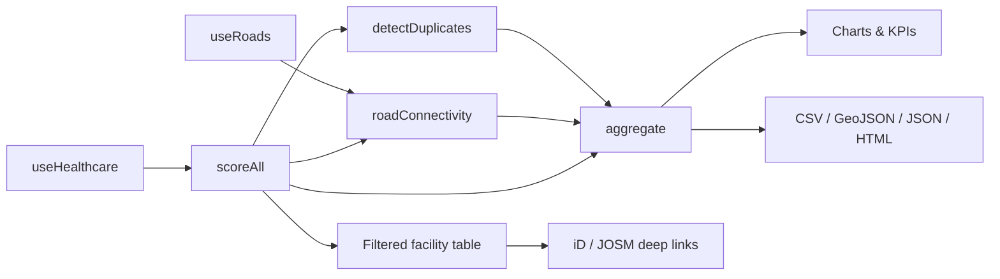

# OSM Data Quality Module

[← Documentation index](../README.md#documentation)

## Table of Contents

- [Purpose](#purpose)
- [Analysis pipeline](#analysis-pipeline)
- [Quality score](#quality-score)
- [Quality bands](#quality-bands)
- [Missing tags analysis](#missing-tags-analysis)
- [Consistency checks](#consistency-checks)
- [Duplicate detection](#duplicate-detection)
- [Road connectivity analysis](#road-connectivity-analysis)
- [Aggregation](#aggregation)
- [Charts](#charts)
- [Filters and worklist](#filters-and-worklist)
- [Reports and export](#reports-and-export)
- [Contribution guidance](#contribution-guidance)
- [Extending the rubric](#extending-the-rubric)
- [Limitations](#limitations)

## Purpose

The accessibility module is only as trustworthy as the OSM data beneath it. This module measures that data, explains exactly what is wrong with each facility, and turns the findings into an actionable OSM editing worklist.

Route: `/quality` (`src/routes/quality.tsx`). Logic: `src/lib/quality.ts`. Exports: `src/lib/quality-export.ts`.

## Analysis pipeline



Every stage is a pure function over the fetched elements and is recomputed with `useMemo` — nothing is cached in state, so a data refresh always produces a consistent audit.

## Quality score

`scoreFacility(element)` returns a 0–100 composite from five weighted dimensions:

| Dimension | Weight | Measures |
| --- | --- | --- |
| Attributes | **28%** | `name`, `operator`, `building`, plus `healthcare:speciality` for hospital / clinic / health centre / doctors |
| Contact | **22%** | `phone` (or `contact:phone`), `email`, `website`, `opening_hours` |
| Address | **20%** | The `addr:*` field set |
| Consistency | **20%** | Starts at 100, penalised for contradictory or deprecated tagging |
| Geometry | **10%** | 100 when usable coordinates exist, otherwise 0 |

```ts
score = round(
  attributes   * 0.28 +
  contact      * 0.22 +
  address      * 0.20 +
  consistency  * 0.20 +
  geometry     * 0.10
);
```

Each dimension is itself a percentage of the fields present in its group, so the score is interpretable: a facility scoring 60 has roughly 60% of the documentation a well-mapped facility carries.

Design intent:

- **Attributes are weighted highest** because an unnamed, unattributed facility is nearly useless for planning.
- **Contact is second** because it is what makes a facility actionable in an emergency.
- **Geometry is weighted lowest** not because it is unimportant, but because it is almost always present — it functions as a hard failure flag rather than a gradient.

## Quality bands

| Band | Score | Label | Meaning |
| --- | --- | --- | --- |
| `excellent` | ≥ 90 | Excellent | Well documented; safe for planning use |
| `good` | 75–89 | Good | Usable, with minor gaps |
| `needs` | 50–74 | Needs work | Usable for location only; attributes unreliable |
| `critical` | < 50 | Critical | Barely documented; treat as a mapping task |

Band colours (`BAND_COLOR`) are shared by the map, charts and tables so the visual language is consistent across the module.

## Missing tags analysis

Every absent field produces a `QualityIssue`:

```ts
type QualityIssue = {
  key: string;                                   // "phone", "consistency:...", "connectivity"
  label: string;                                 // human-readable summary
  severity: "critical" | "warn" | "info";
  suggestion: string;                            // what the contributor should do
  osmTags?: string[];                            // tags to add
};
```

| Group | Fields | Severity | Example suggestion |
| --- | --- | --- | --- |
| Attributes | `name` | critical | "Add a name tag so this facility can be searched and identified." |
| Attributes | `operator` | warn | "Add the operator (e.g. Ministry of Health, private group)." |
| Attributes | `building` | warn | "Tag the building geometry (building=hospital, yes, etc.)." |
| Attributes | `healthcare:speciality` | warn | "Add healthcare:speciality (general, maternity, dental…)." |
| Contact | `phone` | warn | "Add a phone number so patients can reach the facility." |
| Contact | `opening_hours` | warn | "Add opening_hours (e.g. 24/7, Mo-Fr 08:00-18:00)." |
| Contact | `email`, `website` | warn | "Add an email contact." / "Add a website URL." |
| Address | `addr:street`, `addr:city` | warn | "Add addr:street to complete the postal address." |
| Address | other `addr:*` | info | Same pattern per field |
| Accessibility | `wheelchair` | info | "Add wheelchair=yes/limited/no so patients with mobility needs can plan visits." |
| Emergency | `emergency` (hospitals and health centres) | info | "Add emergency=yes/no to indicate 24/7 emergency capability." |
| Geometry | no coordinates | critical | "Add a node or centroid so this facility can be located." |

Severity drives ordering in the worklist: critical issues block use entirely, warnings degrade usefulness, info items are enrichment.

`name:en` counts as a name, so bilingual tagging is not penalised.

## Consistency checks

Consistency starts at 100 and is reduced by:

| Check | Penalty | Rationale |
| --- | --- | --- |
| Pharmacy tagged only as `shop` without `healthcare` | −30 | Excluded from healthcare queries by downstream consumers |
| `amenity` conflicts with `healthcare` (e.g. `amenity=hospital` + `healthcare=clinic`) | −25 | Ambiguous facility type; the tolerated exception is `amenity=clinic` with `healthcare=centre/center` |
| Deprecated `health_facility` | −10 | Superseded by the `healthcare=*` scheme |
| Deprecated `health_facility:type` | −10 | Same |

The floor is 0; penalties do not go negative.

## Duplicate detection

`detectDuplicates(scored)` finds probable double-mapped facilities.

**Algorithm**

1. Bucket every facility into a `0.002°` grid cell (~200 m).
2. For each facility, compare against the 3×3 neighbourhood of cells.
3. Discard pairs more than **120 m** apart.
4. Compute a token-overlap name similarity.
5. Grade confidence; de-duplicate pairs by lexicographically ordered key; sort by distance.

**Confidence rules**

| Confidence | Condition | Reason shown |
| --- | --- | --- |
| High | < 15 m **and** (similarity > 0.6 **or** both unnamed with the same type) | "Nearly identical location and similar name/type" |
| Medium | < 50 m, similarity > 0.5, same type | "Close proximity with matching type and name overlap" |
| Medium | < 25 m, same type | "Overlapping location, same facility type" |
| Low | < 100 m, similarity > 0.3 | "Nearby facilities with partial name overlap" |
| — | none matched | Pair discarded |

The spatial grid makes this near-linear rather than O(n²), so tens of thousands of facilities remain interactive in the browser.

**Important:** these are *candidates*, never automatic merges. Legitimately co-located facilities exist — a pharmacy inside a hospital campus, or an outpatient clinic beside a ward block. Always verify against imagery or local knowledge before merging in OSM.

## Road connectivity analysis

`roadConnectivity(scored, roads, thresholdM = 150)` measures how far each facility is from the mapped road network.

1. Flatten every road way's geometry into a node list.
2. Index nodes into a `0.01°` grid.
3. For each facility, search the 5×5 cell neighbourhood for the nearest node.
4. Record the distance; if it exceeds **150 m**, attach a `connectivity` issue.

Suggested remedy: *"Trace an access road, service track, or footway from the nearest highway to this facility."*

This check matters more than it appears: a facility with no road connection **cannot be routed to**. A perfect attribute score with a connectivity failure still means an ambulance cannot be given directions.

Caveat: the threshold is fixed and unit-blind to context. Rural facilities served by genuinely unmapped tracks will be flagged — which is usually correct, since the track should be mapped.

## Aggregation

`aggregate(scored, duplicates, disconnected)` produces the dashboard summary:

| Field | Meaning |
| --- | --- |
| `total` | Facilities analysed |
| `complete` | Facilities scoring ≥ 90 |
| `incomplete` | Remainder |
| `unnamed` | Facilities with no `name`/`name:en` |
| `missingPhone` | No `phone` or `contact:phone` |
| `missingHours` | No `opening_hours` |
| `missingAddress` | Incomplete `addr:*` |
| `duplicateCandidates` | Number of candidate pairs |
| `disconnected` | Facilities beyond the connectivity threshold |
| `overall` | Mean score across all facilities |
| `band` | Band of the overall score |
| `byType` | `{ total, avgScore }` per facility type |
| `byState` | `{ total, avgScore }` per state |
| `topIssues` | Most frequent issues with counts |

`topIssues` is the campaign-planning output: it tells a mapping coordinator which single tag, added systematically, would raise the regional score most.

## Charts

Recharts panels on `/quality`:

| Chart | Content |
| --- | --- |
| Band distribution | Facility counts per quality band, coloured by `BAND_COLOR` |
| Score by facility type | Average score per type, exposing systematic under-documentation |
| Top issues | Ranked issue frequency |

## Filters and worklist

| Filter | Options |
| --- | --- |
| Facility type | `all` or any detected type |
| Quality band | `all`, excellent, good, needs work, critical |
| Issue | `all`, `unnamed`, and other issue keys |
| Free text | Name substring search |

The filtered table is the contributor's worklist. Each row shows the score, band, missing tags and issue list, with actions to focus the facility on the map, copy its identifier, or open it in an editor.

`NearbyQualityPanel` provides the same analysis around a chosen point, which suits field verification.

## Reports and export

| Export | Function | Contents | Use |
| --- | --- | --- | --- |
| CSV | `exportCsv(scored)` | One row per facility: type/id, name, facility type, coordinates, score, band, dimension breakdown, missing tags | Spreadsheets, statistics |
| GeoJSON | `exportGeoJson(scored)` | Point features with score properties | QGIS, ArcGIS, web maps |
| Issues JSON | `exportIssuesJson(scored, duplicates, agg)` | Full issue list, duplicate pairs, aggregate metrics | Tasking managers, scripts, dashboards |
| HTML report | `exportHtmlReport(agg, scored, duplicates)` | Self-contained formatted report | Offline field use, stakeholder briefings |

The HTML report is deliberately dependency-free so it opens on any device without connectivity — a practical requirement for field teams.

## Contribution guidance

Every issue carries a plain-language suggestion, and every facility row exposes three deep links:

| Link | Builder | Use |
| --- | --- | --- |
| View on OSM | `osmUrl(el)` | Inspect the feature and its edit history |
| Edit in iD | `idEditorUrl(el)` | Browser editing, no setup |
| Open in JOSM | `josmRemoteUrl(el)` | Power editing; requires JOSM with remote control on port 8111 |

Recommended contributor workflow:

1. Select a study area and set the band filter to **critical**.
2. Work top-down: unnamed facilities first — a name unlocks search, routing labels and verification.
3. Add contact details only when you can verify them; never invent a phone number.
4. Verify against Esri imagery before adding `building` tags.
5. For duplicate candidates, confirm on the ground or in imagery, then merge in JOSM.
6. Use a descriptive changeset comment, e.g. `Add contact and address tags to health facilities in Ibadan North (opadbisrescue audit)`.
7. Refresh after a few minutes to see the score move.

Never bulk-import or machine-edit without an approved OSM import plan and community discussion.

## Extending the rubric

To add a check:

1. Add the detection inside `scoreFacility()` (or a new pass alongside `detectDuplicates`/`roadConnectivity`).
2. Push a `QualityIssue` with a stable `key`, clear `label`, correct `severity` and an actionable `suggestion`.
3. If it should affect the score, decide which dimension it belongs to — do not silently change weights.
4. If weights or thresholds change, note it in `CHANGELOG.md` and update the tables above, because published scores become incomparable across versions.
5. Add a unit test over a fixture element ([testing.md](./testing.md)).

Checks worth adding next: `opening_hours` syntax validation, phone-number format normalisation (E.164), operator-type consistency (`operator:type=government|private`), and name-language completeness.

## Limitations

| Limitation | Impact | Mitigation |
| --- | --- | --- |
| Weights are expert judgement, not empirically calibrated | Scores are internally consistent but not externally validated | Weights are published and versioned; recalibrate with field survey data |
| Absence of a tag ≠ absence of a service | A hospital without `emergency=yes` may still have an emergency department | Issues are marked `info` where absence is weak evidence |
| Duplicate detection is heuristic | False positives | Confidence grading plus mandatory human verification |
| 150 m connectivity threshold is fixed | Over-flags rural facilities | Documented and tunable in `quality.ts` |
| Analysis is scoped to the loaded study area | Not a national figure unless every area is analysed | Analyse per LGA and aggregate externally |
| No temporal comparison | Improvement over time is not visible in-app | Export snapshots; see the proposed `quality_snapshots` table in [database.md](./database.md) |
| Name similarity is token-overlap based | Weak on transliteration variants and abbreviations | Consider phonetic or edit-distance matching in a future release |
