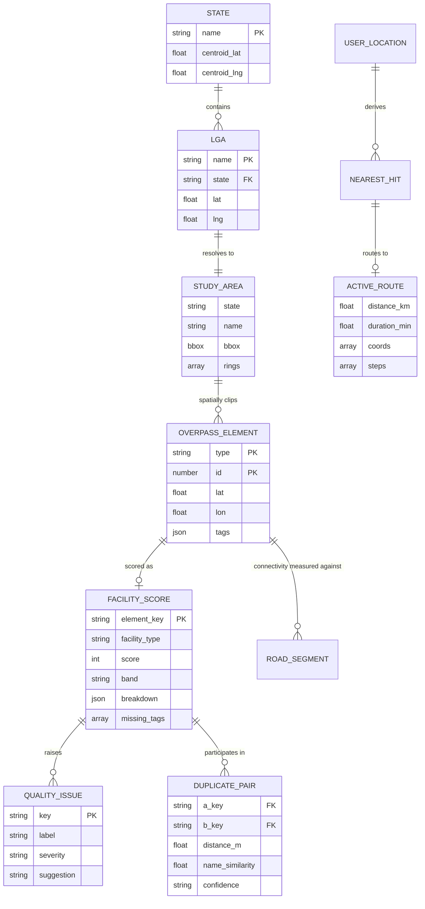
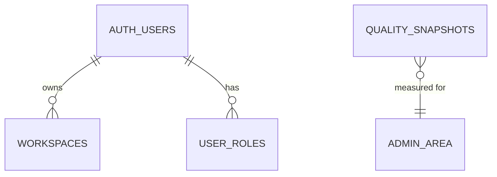

# Data Sources & Storage Strategy

[← Documentation index](../README.md#documentation)

## Table of Contents

- [Current status: no database](#current-status-no-database)
- [Why no database](#why-no-database)
- [Data sources](#data-sources)
- [In-memory data model](#in-memory-data-model)
- [Entity relationship diagram (logical)](#entity-relationship-diagram-logical)
- [Caching strategy](#caching-strategy)
- [Client-side persistence](#client-side-persistence)
- [Export formats](#export-formats)
- [Proposed schema if persistence is added](#proposed-schema-if-persistence-is-added)
- [Migration considerations](#migration-considerations)

## Current status: no database

> **The application uses no database.** There is no PostgreSQL, no SQLite, no ORM, no migrations and no connection string. Nothing the user does is persisted server-side.

All data is fetched live from OpenStreetMap services, held in browser memory for the session, cached by TanStack Query, and discarded on reload. Durable output is produced by the export functions, not by a datastore.

## Why no database

| Reason | Detail |
| --- | --- |
| The source of truth is external | OSM is authoritative and continuously updated; a copy would immediately be stale |
| Freshness matters | A contributor should see their edit reflected minutes later, which caching a snapshot would defeat |
| No user-generated content | The application analyses; it does not author |
| Zero privacy surface | No stored personal data means no breach exposure and minimal compliance burden |
| Cost and operations | No backups, failover, patching, or scaling to manage |
| Portability | Any organisation can deploy it in minutes, offline of any managed service |

The trade-offs — no saved workspaces, no historical trend analysis, no scheduled reports — are recorded in [project-overview.md](./project-overview.md#limitations) and addressed in [future-roadmap.md](./future-roadmap.md).

## Data sources

| Source | Data | Access path | Volatility | Licence |
| --- | --- | --- | --- | --- |
| Overpass API | Health facilities, roads, settlements, transport, emergency features | `runOverpass` server function | Minutes | ODbL |
| Nominatim | State/LGA boundary polygons | `getAdminBoundary` server function | Rare | ODbL |
| Overpass (relations) | Boundary fallback via `admin_level` 4/6 | `getAdminBoundary` | Rare | ODbL |
| OSRM | Route geometry, distance, duration, steps | Browser fetch | Per request | ODbL-derived |
| Tile CDNs | Raster basemap imagery | Browser | Cached by CDN | Provider-specific |
| `src/lib/nigeria-admin.ts` | 36 states + FCT, 770+ LGA names and centroids | Bundled static module | Static | Project data |

`nigeria-admin.ts` is the only "database-like" artefact in the repository: a compiled-in reference table of administrative names and centroids used for selection and initial centring. Real geometry always comes from OSM.

## In-memory data model

```ts
// src/lib/oyo.ts — the raw OSM record
type OverpassElement = {
  type: "node" | "way" | "relation";
  id: number;
  lat?: number; lon?: number;
  center?: { lat: number; lon: number };
  geometry?: { lat: number; lon: number }[];
  tags?: Record<string, string>;
};

type BBox = { south: number; west: number; north: number; east: number };

// src/lib/study-area.ts — the analysis boundary
type StudyArea = {
  state: string;
  name: string;
  bbox: BBox;
  rings: Position[][];
};

// src/lib/quality.ts — the derived audit record
type FacilityScore = {
  element: OverpassElement;
  coords: [number, number] | null;
  facilityType: string;
  score: number;                 // 0–100
  band: "excellent" | "good" | "needs" | "critical";
  breakdown: { attributes: number; contact: number; address: number; consistency: number; geometry: number };
  addressCompleteness: number;
  missingTags: string[];
  issues: QualityIssue[];
  name: string;
  unnamed: boolean;
};

// src/lib/store.ts — session state
type NearestHit = { category: NearestCategory; element: OverpassElement; coords: [number, number]; distanceKm: number };
type ActiveRoute = { coords: [number, number][]; distanceKm: number; durationMin: number; destination: NearestHit; steps?: RouteStepLite[] };
```

### Logical keys and constraints

| Concept | Key | Enforced by |
| --- | --- | --- |
| Facility identity | `${element.type}/${element.id}` | Composite key used in every `Map`/`Set` |
| Study-area membership | `pointInStudyArea(area, lat, lng)` | Ray-casting point-in-polygon on outer rings |
| Cache identity | `["op", layer, quantizedBboxOrStudyAreaKey]` | TanStack Query key |
| Duplicate pair identity | Lexicographically ordered `idA|idB` | `Set` de-duplication in `detectDuplicates` |
| Layer classification | `layerOfElement(element)` | Tag-precedence function |

## Entity relationship diagram (logical)

Logical relationships only — no physical tables exist.



## Caching strategy

TanStack Query is the de facto data layer.

| Parameter | Value | Rationale |
| --- | --- | --- |
| `staleTime` | 30 minutes | OSM changes slowly relative to a session; avoids re-hitting rate-limited mirrors |
| `gcTime` | 60 minutes | Keeps recently visited areas instantly re-renderable |
| `retry` | 3 | Overpass mirrors fail transiently |
| `retryDelay` | `min(1000·2^n, 20000)` | Backoff that respects mirror recovery windows |
| Key shape (viewport) | `["op", layer, quantizeBbox(bounds)]` | Rounded bbox prevents cache thrash from tiny pans |
| Key shape (study area) | `["op-bundle", "sa:<state>/<lga>:<bbox@3dp>"]` | One cache entry per administrative area |

Inside a study area, a **single bundled query** fetches every layer at once and is then split client-side by `layerOfElement()`. This turns ten competing rate-limited requests into one.

## Client-side persistence

| Store | Contents | Lifetime |
| --- | --- | --- |
| React/Zustand memory | Selection, layers, basemap, routes, nearest results | Until reload |
| TanStack Query cache | Overpass responses | 60 minutes, in memory |
| `localStorage` | Guided-tour "seen" flags only | Until cleared |
| Browser tile cache | Raster tiles | Per HTTP cache headers |
| Geolocation | User position | In memory only; never transmitted to the application server |

No cookies are used for identity. No analytics are enabled by default.

## Export formats

Exports are the durable artefact and the substitute for a database (`src/lib/quality-export.ts`).

| Function | Format | Contents | Typical use |
| --- | --- | --- | --- |
| `exportCsv(scored)` | CSV | One row per facility: identity, type, coordinates, score, band, breakdown, missing tags | Spreadsheet analysis |
| `exportGeoJson(scored)` | GeoJSON `FeatureCollection` | Point features with score properties | QGIS/ArcGIS |
| `exportIssuesJson(scored, duplicates, agg)` | JSON | Full issue list, duplicate pairs and aggregate metrics | Programmatic workflows, tasking managers |
| `exportHtmlReport(agg, scored, duplicates)` | Standalone HTML | Formatted, self-contained report | Offline field use, stakeholder briefings |

Accessibility-module exports follow the same pattern from the analytics panel.

## Proposed schema if persistence is added

Only if roadmap features require it (saved workspaces, historical trends, scheduled reports). Every `CREATE TABLE` in the `public` schema **must** be followed by explicit `GRANT`s, then RLS, then policies.

```sql
-- Saved study areas -----------------------------------------------------
create table public.workspaces (
  id          uuid primary key default gen_random_uuid(),
  user_id     uuid not null references auth.users(id) on delete cascade,
  name        text not null,
  state       text not null,
  lga         text,
  layers      jsonb not null default '{}'::jsonb,
  basemap     text not null default 'carto-light',
  created_at  timestamptz not null default now(),
  updated_at  timestamptz not null default now()
);

grant select, insert, update, delete on public.workspaces to authenticated;
grant all on public.workspaces to service_role;

alter table public.workspaces enable row level security;

create policy "Users manage own workspaces"
  on public.workspaces for all to authenticated
  using (user_id = auth.uid())
  with check (user_id = auth.uid());

create index workspaces_user_idx on public.workspaces (user_id);
create index workspaces_area_idx on public.workspaces (state, lga);

-- Quality score history --------------------------------------------------
create table public.quality_snapshots (
  id             uuid primary key default gen_random_uuid(),
  state          text not null,
  lga            text,
  captured_at    timestamptz not null default now(),
  total          integer not null,
  overall_score  numeric(5,2) not null,
  unnamed        integer not null default 0,
  missing_phone  integer not null default 0,
  duplicates     integer not null default 0,
  disconnected   integer not null default 0,
  by_type        jsonb not null default '{}'::jsonb
);

grant select on public.quality_snapshots to anon, authenticated;
grant all on public.quality_snapshots to service_role;

alter table public.quality_snapshots enable row level security;

create policy "Snapshots are publicly readable"
  on public.quality_snapshots for select to anon, authenticated
  using (true);

create index quality_snapshots_area_time_idx
  on public.quality_snapshots (state, lga, captured_at desc);
```



## Migration considerations

Before introducing persistence:

1. **Confirm necessity.** If a feature can be served by an export, prefer the export.
2. **Never cache OSM entities as the source of truth.** Store only derived aggregates (snapshots), never a mirror of facility records — that would create an ODbL-derived database with share-alike obligations and immediate staleness.
3. **Add authentication first** ([authentication.md](./authentication.md)) — user-scoped tables are meaningless without identity.
4. **Grant, then RLS, then policies**, in that order, in the same migration as the `CREATE TABLE`.
5. **Keep the public dashboards unauthenticated** so the core public-good use case survives.
6. **Document the schema here** and add a `CHANGELOG.md` entry.
