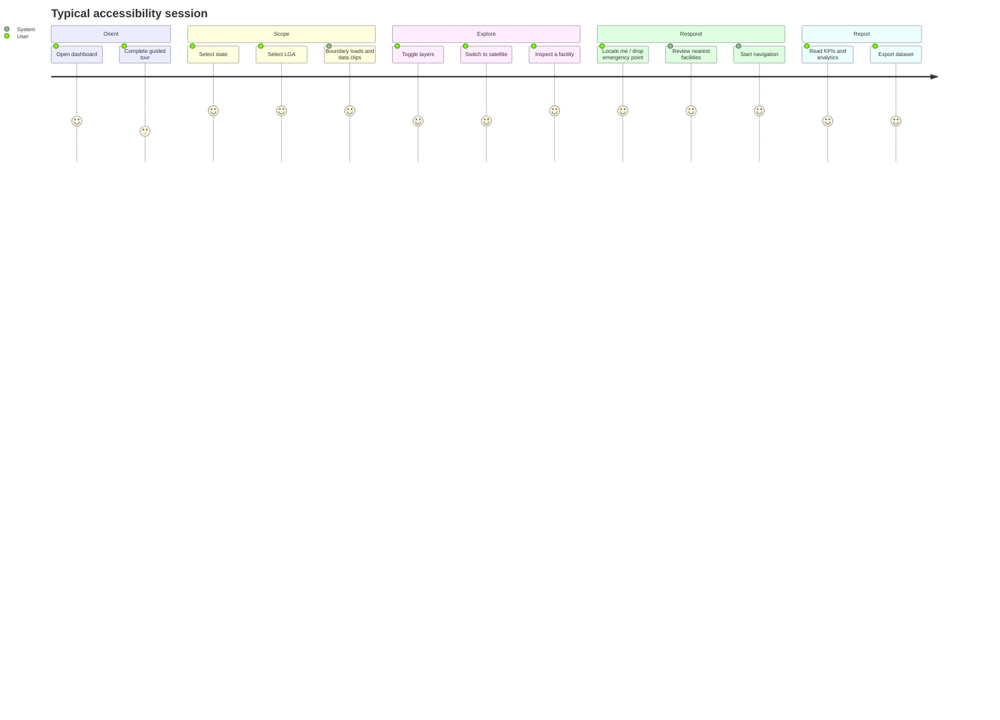

# Healthcare Accessibility & Emergency Response Module

[← Documentation index](../README.md#documentation)

## Table of Contents

- [Purpose](#purpose)
- [User journey](#user-journey)
- [Feature reference](#feature-reference)
  - [Interactive map](#interactive-map)
  - [State and LGA selection](#state-and-lga-selection)
  - [Locate me](#locate-me)
  - [Nearest facility search](#nearest-facility-search)
  - [Emergency navigation](#emergency-navigation)
  - [Healthcare search and filtering](#healthcare-search-and-filtering)
  - [Layer management](#layer-management)
  - [Satellite basemap](#satellite-basemap)
  - [Analytics and KPIs](#analytics-and-kpis)
  - [Accessibility analysis](#accessibility-analysis)
  - [Export](#export)
  - [Guided onboarding](#guided-onboarding)
- [Methodology and assumptions](#methodology-and-assumptions)
- [Known limitations](#known-limitations)

## Purpose

Answer three operational questions for any Nigerian state or LGA:

1. **What health infrastructure exists here, and where?**
2. **How far is the population from it?**
3. **In an emergency at this exact point, where do I go and how do I get there?**

Route: `/` (`src/routes/index.tsx`).

## User journey

## Feature reference

### Interactive map

| Aspect | Detail |
| --- | --- |
| Component | `src/components/gis/OyoMap.tsx` |
| Engine | Leaflet 1.9 via react-leaflet 5 |
| Default view | `[9.08, 8.68]` — national extent |
| Clustering | `leaflet.markercluster` for facility layers |
| Interaction | Click a marker to select; popups show name, type and key tags |
| Viewport sync | `moveend`/`zoomend` write `{ bounds, zoom }` to the store, driving viewport-scoped queries |
| Loading | Lazily imported after hydration; shows "Initializing map…" then "Loading map…" |

Selecting a feature populates `RightPanel`, which renders the full OSM tag table and contextual actions.

### State and LGA selection

| Aspect | Detail |
| --- | --- |
| Component | `src/components/shared/AdminAreaSelector.tsx` |
| Reference data | `src/lib/nigeria-admin.ts` — 36 states + FCT, 770+ LGAs with centroids |
| Boundary source | `getAdminBoundary` → Nominatim, falling back to Overpass relation stitching |
| Result | A `StudyArea` (`state`, `name`, `bbox`, `rings`) in the store |
| Effect | All queries are scoped to the bbox and all results clipped by point-in-polygon |

Selecting an area resets the current selection and any active route — carrying them across areas would be misleading.

Once a study area exists, one **bundled Overpass query** loads every layer at once (90 s timeout) instead of ten competing requests, which materially improves success rates against rate-limited mirrors.

### Locate me

| Aspect | Detail |
| --- | --- |
| API | `navigator.geolocation.getCurrentPosition` |
| Stored as | `{ lat, lng, accuracy }` in the Zustand store |
| Rendering | Position marker plus an accuracy circle |
| Privacy | Position stays in browser memory; it is never sent to the application server |
| Requirements | HTTPS (or `localhost`) and user permission |
| Failure | Permission denied or unavailable → toast; the user can drop an emergency point manually instead |

### Nearest facility search

| Aspect | Detail |
| --- | --- |
| Implementation | `findNearestFacilities()` in `src/lib/nearest.ts` |
| Trigger | "Locate me", or dropping an emergency point on the map |
| Radii | 5 km → 10 km → 25 km → 50 km, stopping as soon as all four categories are found |
| Categories | hospital, clinic, pharmacy, ambulance station |
| Distance | Haversine great-circle, in kilometres |
| Output | One nearest hit per category with element, coordinates and distance |
| UI | `NearestPanel.tsx` — per-category cards with distance, name and a navigate action |
| Cancellation | `AbortSignal`; superseded searches are cancelled |

Classification precedence: `emergency=ambulance_station` → ambulance; `amenity`/`healthcare` = hospital → hospital; clinic or `healthcare=centre/center` → clinic; pharmacy → pharmacy.

The expanding-radius design is deliberate: dense urban areas resolve on the first 5 km query, while rural areas widen automatically rather than returning an empty result.

### Emergency navigation

| Aspect | Detail |
| --- | --- |
| Implementation | `fetchOsrmRoute()` in `src/lib/nearest.ts`; UI in `NavigationGuide.tsx` |
| Engine | OSRM (`router.project-osrm.org` by default) |
| Modes | Driving, walking, cycling |
| Preference | Fastest or shortest |
| Alternatives | Optional alternative routes |
| Output | Polyline, distance (km), duration (min), turn-by-turn steps |
| Instructions | OSRM manoeuvres humanised into readable phrases |
| Rendering | Route polyline over the basemap with start and destination markers |

Steps carry instruction text, distance, duration, road name, manoeuvre type/modifier and the manoeuvre location, so the panel can highlight the corresponding point on the map.

Durations assume free-flowing traffic and ignore road surface condition and seasonality — treat them as comparative, not predictive.

### Healthcare search and filtering

| Control | Behaviour |
| --- | --- |
| Free-text search | Filters visible facilities by name substring (`search` in the store) |
| Facility filter | `all`, `hospital`, `clinic`, `pharmacy`, and other recognised types |
| Layer toggles | Independent of search; control which datasets are fetched and drawn |

Filtering is client-side over already-fetched data, so it is instantaneous and adds no Overpass load.

### Layer management

Ten toggleable layers (`LayerToggles` in `src/lib/store.ts`):

| Layer | Default | Content |
| --- | --- | --- |
| `hospitals` | on | `amenity=hospital`, `healthcare=hospital` |
| `clinics` | on | `amenity=clinic`, `healthcare=clinic` |
| `pharmacies` | on | `amenity=pharmacy`, `healthcare=pharmacy`, `shop=chemist` |
| `healthCentres` | on | `healthcare=centre/center` |
| `doctors` | on | `amenity=doctors`, `healthcare=doctor` |
| `emergency` | on | Ambulance stations and related emergency features |
| `settlements` | off | Places: cities, towns, villages |
| `transport` | off | Transport nodes relevant to access |
| `roads` | on | Highway network (also feeds connectivity analysis) |
| `boundary` | on | The selected administrative boundary |

Each layer carries a `LAYER_MIN_ZOOM` and `LAYER_MAX_AREA` guard so a zoomed-out viewport cannot trigger an unbounded national query. Inside a study area the guard is relaxed 8× because the bundled query is already bounded by the boundary bbox.

Settlements and transport default to off to keep the initial payload small on constrained connections.

### Satellite basemap

Five basemaps via `BasemapGallery`: OSM Standard, OSM Humanitarian, **Esri World Imagery**, Carto Light (default) and Carto Dark. Imagery is the verification basemap — it lets a user confirm that a mapped facility corresponds to a real structure, and spot buildings that are missing from OSM entirely. Attribution is rendered for every provider.

### Analytics and KPIs

| Surface | Content |
| --- | --- |
| `KpiBar.tsx` | Headline counts for the study area: facilities by category, totals, live data indicator |
| `BottomPanel.tsx` | Tabular analytics and distribution summaries |
| `RightPanel.tsx` | Per-feature detail: full tag table and actions |

All figures recompute from the clipped dataset whenever the study area, layers or filters change.

### Accessibility analysis

Indicators derived from the clipped dataset:

| Indicator | Method |
| --- | --- |
| Facility count by type | Tag classification over clipped elements |
| Facility density | Count relative to the study-area extent |
| Distance to nearest facility | Haversine from a chosen point, via the nearest-facility search |
| Emergency reachability | OSRM travel time from a chosen point to the nearest facility |
| Coverage gaps | Areas within the boundary with no facility inside the smallest search radius |

The analysis is **facility-centric**, not population-weighted: it does not yet ingest population rasters, so "coverage" means spatial coverage rather than population coverage. Population weighting is on the roadmap.

### Export

The working dataset can be exported for offline analysis. The quality module's writers (`src/lib/quality-export.ts`) provide the shared formats — CSV, GeoJSON, JSON and standalone HTML — so accessibility findings and quality findings interoperate in the same GIS project.

Exports carry the OSM attribution string; keep it when redistributing.

### Guided onboarding

| Element | Behaviour |
| --- | --- |
| First-visit tour | Opens automatically; the "seen" flag is stored in `localStorage` |
| `HelpMenu` | Re-open the tour at any time |
| `QuickStartChecklist` | Progressive checklist overlaid on the map |
| `NavigationGuide` | Contextual guidance during emergency navigation |

Tour steps anchor to `data-tour` attributes. When you move or rename an anchored element, update `src/components/tour/accessibility-tour.ts` in the same commit.

## Methodology and assumptions

| Assumption | Rationale | Risk |
| --- | --- | --- |
| OSM is a usable proxy for facility location | It is the only openly licensed, continuously updated national layer | Under-mapping in rural areas; quantified by the quality module |
| Straight-line distance approximates access for triage | Fast, dependency-free, adequate for comparison | Underestimates travel in areas with poor road connectivity |
| OSRM durations approximate travel time | OSM-native and free | Ignores traffic, surface condition and seasonal impassability |
| Centroid geometry is sufficient | Keeps payloads small and mappable | Large hospital campuses reduce to a single point |
| Study-area clipping uses outer rings only | Simple and fast point-in-polygon | Enclaves/holes are not excluded |
| 50 km is a reasonable maximum search radius | Beyond it, care is rarely time-viable | Extremely remote areas may return no result |

## Known limitations

1. **Data completeness varies by region** — always read alongside [data-quality-module.md](./data-quality-module.md).
2. **No population weighting** — coverage is spatial, not per capita.
3. **No capacity data** — bed counts, staffing and specialities are largely absent from OSM.
4. **Routing is optimistic** — no traffic, weather or road-condition modelling.
5. **Public OSRM is rate limited** — self-host before production use.
6. **No offline mode** — the application requires connectivity; exports are the offline artefact.
7. **Map is not keyboard accessible** — Leaflet markers cannot be reached by keyboard; use the tabular views.
8. **Large study areas are memory bound** — prefer LGA-level analysis; see [performance.md](./performance.md).
