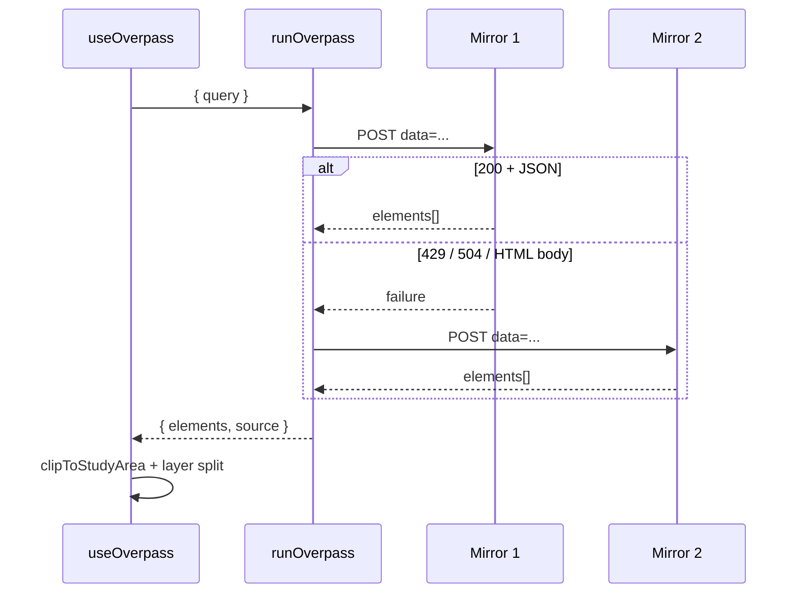

# OpenStreetMap & Third-Party Integrations

[← Documentation index](../README.md#documentation)

## Table of Contents

- [Integration map](#integration-map)
- [Overpass API](#overpass-api)
- [Nominatim](#nominatim)
- [OSRM routing](#osrm-routing)
- [Tile providers](#tile-providers)
- [OSM editors](#osm-editors)
- [OSM tagging model](#osm-tagging-model)
- [Error handling and fallbacks](#error-handling-and-fallbacks)
- [Rate limiting and etiquette](#rate-limiting-and-etiquette)
- [Self-hosting the OSM stack](#self-hosting-the-osm-stack)
- [Licensing and attribution](#licensing-and-attribution)

## Integration map

| Service | Purpose | Called from | Auth | Failure mode |
| --- | --- | --- | --- | --- |
| Overpass API (4 mirrors) | Query live OSM features by tag and area | Server function | None | Failover, then error |
| Nominatim | Resolve State/LGA names to boundary polygons | Server function | None | Falls back to Overpass |
| OSRM | Route geometry, distance, duration, turn-by-turn | Browser | None | Error toast, map stays usable |
| OSM / HOT / CARTO / Esri tiles | Basemap imagery | Browser | None | Blank tiles; switch provider |
| osm.org, iD, JOSM | Deep links for editing | Browser | User's own OSM session | Link simply does not open |

## Overpass API

### Purpose

Overpass is the only practical way to query current OSM data by tag within an arbitrary area. Everything the application analyses arrives through it.

### Endpoints

Data queries (`src/lib/overpass.functions.ts`), tried in order:

1. `https://maps.mail.ru/osm/tools/overpass/api/interpreter`
2. `https://overpass-api.de/api/interpreter`
3. `https://overpass.kumi.systems/api/interpreter`
4. `https://overpass.private.coffee/api/interpreter`

Boundary queries (`src/lib/admin-boundary.server.ts`) lead with `overpass-api.de`, then `maps.mail.ru`, then `kumi.systems`.

### Request format

```http
POST /api/interpreter HTTP/1.1
Content-Type: application/x-www-form-urlencoded
Accept: application/json
User-Agent: Oyo opadbisrescue GIS Dashboard/1.0 (OpenStreetMap data viewer)

data=%5Bout%3Ajson%5D%5Btimeout%3A45%5D%3B...
```

### Query construction

Three builders live in `src/lib/oyo.ts`:

| Builder | Used when | Timeout |
| --- | --- | --- |
| `buildLayerQuery(layer, bbox)` | Viewport-scoped single-layer fetch | 45 s |
| `buildBundleQuery(bbox)` | A study area is selected — all layers in one request | 90 s |
| `buildAroundQuery(lat, lng, radius)` (`nearest.ts`) | Nearest-facility search | 30 s |

Example layer query:

```text
[out:json][timeout:45];
(
  nwr["amenity"="hospital"](7.30,3.80,7.50,4.05);
  nwr["healthcare"="hospital"](7.30,3.80,7.50,4.05);
);
out center tags;
```

`nwr` matches nodes, ways and relations. `out center tags` returns a centroid for non-node geometries, which keeps payloads small while remaining mappable.

### Guards

| Guard | Where | Effect |
| --- | --- | --- |
| `LAYER_MIN_ZOOM` | `oyo.ts` | A layer will not query below its minimum zoom |
| `LAYER_MAX_AREA` | `oyo.ts` | A layer will not query above its maximum bbox area (in square degrees); the study-area path allows 8× |
| Bundled query | `useOverpass.ts` | One request per study area instead of ten |
| `quantizeBbox` | `oyo.ts` | Rounded cache keys so tiny pans reuse cached results |
| 30-min stale time | `useOverpass.ts` | Repeat visits do not re-query |

### Integration workflow



### Error handling

| Failure | Detection | Response |
| --- | --- | --- |
| HTTP 429 / 504 | Status check | Next mirror |
| HTML error page with HTTP 200 | Body starts with `<` | Next mirror |
| Timeout | 60 s `AbortController` | Next mirror |
| Network error | `catch` | Next mirror |
| All mirrors down | Loop exhausted | Throw; Query retries 3× with backoff; UI shows an error state |

## Nominatim

### Purpose

Resolve a human-readable administrative name to a boundary polygon.

```http
GET /search?format=json&polygon_geojson=1&limit=8&q=Ibadan%20North%2C%20Oyo%2C%20Nigeria
Accept: application/json
User-Agent: opadbisrescue GIS Dashboard/1.0 (OpenStreetMap boundary viewer)
```

Selection logic: the first hit whose `geojson.type` is `Polygon` or `MultiPolygon` **and** whose `class` is `boundary` or whose `osm_type` is `relation`. This filters out point results and non-administrative matches (a hospital named after a town, for instance).

### Configuration

`NOMINATIM_BASE_URL` overrides the host. Self-host for anything beyond occasional interactive use.

### Fallback

If Nominatim returns nothing usable, the Overpass relation query runs and rings are stitched manually. Only if both fail does the function return `null`.

### Etiquette

Nominatim's policy allows at most **1 request per second** and prohibits bulk geocoding. The application only calls it on explicit user selection, which stays well within policy for interactive use.

## OSRM routing

### Purpose

Turn a start/destination pair into a drivable route with turn-by-turn instructions for emergency navigation.

```http
GET /route/v1/driving/3.9470,7.3775;3.8964,7.3878
    ?overview=full&geometries=geojson&steps=true&alternatives=false&annotations=false
```

| Application mode | OSRM profile |
| --- | --- |
| `driving` | `driving` |
| `walking` | `foot` |
| `cycling` | `bike` |

> Coordinates in the URL are **lng,lat**; application state uses **[lat, lng]**. This inversion is the single most common bug in routing code — convert explicitly at the boundary.

### Response processing

`fetchOsrmRoute` extracts geometry coordinates, distance (→ km), duration (→ minutes) and steps, then humanises each OSRM manoeuvre into a readable instruction (`turn`, `new name`, `continue`, `merge`, `on ramp`, `off ramp`, `fork`, `end of road`, `roundabout`, `rotary`), falling back to a generic type/modifier phrase for anything unrecognised.

### Error handling and fallback

| Condition | Handling |
| --- | --- |
| Non-2xx | `Error("OSRM <status>")`, toast, map remains usable |
| HTTP 200 with empty `routes[]` | Treated as "no route found" — common where access roads are unmapped |
| Abort | Request cancelled when the user changes destination |
| Rate limited | Toast advising a retry; consider self-hosting |

There is no automatic routing fallback provider. If a route cannot be produced, the nearest-facility list and straight-line distances remain available — an intentional graceful degradation, since straight-line distance is still decision-useful.

### Configuration

`VITE_OSRM_BASE_URL` points at a self-hosted OSRM. The public demo server carries an explicit "not for production" notice.

## Tile providers

| Key | Provider | URL template | Max zoom | Attribution (mandatory) |
| --- | --- | --- | --- | --- |
| `osm` | OpenStreetMap Standard | `https://tile.openstreetmap.org/{z}/{x}/{y}.png` | 19 | © OpenStreetMap contributors |
| `hot` | Humanitarian OSM Team | `https://tile.openstreetmap.fr/hot/{z}/{x}/{y}.png` | 20 | © OpenStreetMap · Humanitarian OSM Team |
| `esri-imagery` | Esri World Imagery | `https://server.arcgisonline.com/ArcGIS/rest/services/World_Imagery/MapServer/tile/{z}/{y}/{x}` | 19 | Tiles © Esri — Esri, Maxar, Earthstar Geographics |
| `carto-light` | CARTO Light | `https://{s}.basemaps.cartocdn.com/light_all/{z}/{x}/{y}{r}.png` | 20 | © OSM · © CARTO |
| `carto-dark` | CARTO Dark | `https://{s}.basemaps.cartocdn.com/dark_all/{z}/{x}/{y}{r}.png` | 20 | © OSM · © CARTO |

Note the Esri template's `{z}/{y}/{x}` ordering, which differs from the usual `{z}/{x}/{y}`.

Fallback strategy: tile failures are visually obvious and non-blocking. The default is `carto-light` because a muted canvas maximises overlay legibility. `esri-imagery` is the verification basemap — contributors use it to confirm whether a building actually exists before adding tags.

Never remove attribution: it is a licence condition, not decoration.

## OSM editors

| Target | Link builder | Behaviour |
| --- | --- | --- |
| osm.org | `osmUrl(el)` → `https://www.openstreetmap.org/{type}/{id}` | View the feature and its history |
| iD editor | `idEditorUrl(el)` → `https://www.openstreetmap.org/edit?editor=id&{type}={id}` | Opens the browser editor on the feature |
| JOSM | `josmRemoteUrl(el)` → `http://127.0.0.1:8111/load_object?objects={t}{id}` | Requires JOSM running with remote control enabled |

The application never writes to OSM. Edits happen entirely in the user's own OSM session, which keeps changeset attribution correct and avoids any credential handling.

## OSM tagging model

Recognised healthcare tags (`facilityType()` and `classify()`):

| Facility | Tags |
| --- | --- |
| Hospital | `amenity=hospital`, `healthcare=hospital` |
| Clinic | `amenity=clinic`, `healthcare=clinic` |
| Health centre | `healthcare=centre`, `healthcare=center` |
| Doctors | `amenity=doctors`, `healthcare=doctor` |
| Pharmacy | `amenity=pharmacy`, `healthcare=pharmacy`, `shop=chemist` |
| Ambulance station | `emergency=ambulance_station` |

Attributes evaluated by the quality module: `name`, `name:en`, `operator`, `building`, `healthcare:speciality`, `phone`, `contact:phone`, `email`, `website`, `opening_hours`, `addr:*`, `wheelchair`, `emergency`.

Deprecated tags flagged: `health_facility`, `health_facility:type`.

Reference: [OSM Healthcare wiki](https://wiki.openstreetmap.org/wiki/Healthcare).

## Error handling and fallbacks

| Integration | Primary | Fallback 1 | Fallback 2 | Final degradation |
| --- | --- | --- | --- | --- |
| Overpass data | maps.mail.ru | overpass-api.de | kumi.systems → private.coffee | Error state with retry |
| Boundary | Nominatim | Overpass relation (3 mirrors) | — | `null`; previous view retained |
| Routing | OSRM | — | — | Straight-line distance from nearest search |
| Tiles | Selected basemap | User switches provider | — | Grey canvas; overlays still render |
| Editors | iD | JOSM | osm.org view | — |

## Rate limiting and etiquette

| Service | Policy | Compliance measure |
| --- | --- | --- |
| Overpass | ~2 concurrent slots and a CPU-time quota per IP | Mirror rotation, bundled queries, 30-min cache, zoom/area gates |
| Nominatim | ≤1 req/s, no bulk geocoding, descriptive UA required | Called only on explicit selection, with a descriptive UA |
| OSRM demo | Undocumented, low | Routing only on explicit user action |
| Tiles | Fair-use, no bulk scraping | Standard Leaflet tile loading, browser caching, provider `maxZoom` respected |

Operator obligations before serving real traffic:

1. Set `OSM_USER_AGENT` to an organisation-identifying string with a contact address.
2. Self-host Overpass and OSRM.
3. Add edge caching in front of the server functions.
4. Monitor upstream error rates and back off when mirrors degrade.

## Self-hosting the OSM stack

Recommended for any production deployment.

| Component | Software | Typical resources (Nigeria extract) |
| --- | --- | --- |
| Overpass | `wiktorn/overpass-api` (Docker) | 4 CPU, 16 GB RAM, 100 GB SSD |
| OSRM | `osrm/osrm-backend` (Docker) | 4 CPU, 8 GB RAM, 50 GB SSD |
| Nominatim | `mediagis/nominatim` (Docker) | 4 CPU, 16 GB RAM, 200 GB SSD |
| Tiles | Existing CDNs, or a self-hosted renderer | — |

Use the Geofabrik Nigeria extract and refresh with minutely or daily diffs. Then set `OVERPASS_ENDPOINTS`, `NOMINATIM_BASE_URL` and `VITE_OSRM_BASE_URL`. No code changes are required.

## Licensing and attribution

- OSM data is © OpenStreetMap contributors, licensed **ODbL 1.0**.
- Attribution must remain visible on the map and in every export.
- Producing and publishing a *derived database* triggers ODbL share-alike obligations; produced works (maps, reports) require attribution only.
- CARTO and Esri tiles carry their own terms — preserve their attribution strings exactly as defined in `src/lib/basemaps.ts`.
- The MIT licence covers this repository's source code only; it does not relicense OSM data or exports.
