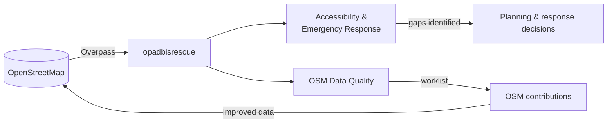

# Project Overview

[← Documentation index](../README.md#documentation)

## Table of Contents

- [The problem](#the-problem)
- [The solution](#the-solution)
- [Module 1 — Healthcare Accessibility & Emergency Response](#module-1--healthcare-accessibility--emergency-response)
- [Module 2 — OSM Data Quality](#module-2--osm-data-quality)
- [Expected users](#expected-users)
- [Real-world use cases](#real-world-use-cases)
- [Objectives](#objectives)
- [Benefits](#benefits)
- [Scope](#scope)
- [Limitations](#limitations)

## The problem

Nigeria has more than 40,000 registered health facilities serving over 220 million people, yet the spatial record of those facilities is fragmented. Public registries are rarely geocoded, private facilities are under-recorded, and the open geospatial layer that planners and responders actually reach for — OpenStreetMap — has uneven coverage and highly variable attribute completeness.

Three practical consequences follow:

1. **Planners cannot see gaps.** Without reliable coordinates, "which communities are more than 10 km from a hospital?" cannot be answered consistently at LGA resolution.
2. **Responders lose time.** In an emergency, identifying the nearest appropriate facility and a viable route is a manual, local-knowledge exercise.
3. **Contributors cannot prioritise.** OSM volunteers and HOT mapping campaigns lack a systematic view of *which* facilities are worst documented and *what specifically* is missing.

Existing tools address at most one of these. Accessibility platforms assume clean input data; OSM quality tools (Osmose, KeepRight) are generic and not healthcare-aware.

## The solution

opadbisrescue couples an accessibility/emergency workspace with a healthcare-specific data-quality auditor over the same live OpenStreetMap extract. Analysis and audit run against identical data, so a planner can see an accessibility gap and immediately tell whether it is a *real* service gap or a *data* gap — a distinction most dashboards silently collapse.

The feedback loop is deliberate: better data improves the accessibility analysis, which in turn identifies where better data matters most.

## Module 1 — Healthcare Accessibility & Emergency Response

Purpose: understand *where* care exists, *how far* people are from it, and *how fast* it can be reached.

Capabilities:

- Select any of the 36 states or the FCT, and optionally an LGA; the real administrative boundary is fetched from OSM and every dataset is clipped to it.
- One bundled Overpass request loads hospitals, clinics, pharmacies, health centres, doctors, emergency services, settlements, transport and roads for the study area.
- Toggle ten thematic layers over five basemaps including high-resolution satellite imagery.
- Locate the user via browser geolocation, or drop an emergency point anywhere on the map.
- Find the nearest hospital, clinic, pharmacy and ambulance station using expanding search radii.
- Generate a route with driving, walking or cycling profiles, complete with distance, duration and turn-by-turn instructions.
- Read KPI and analytics panels covering facility counts, mix, and accessibility indicators for the study area.
- Export the working dataset for offline analysis.

Detail: [healthcare-module.md](./healthcare-module.md).

## Module 2 — OSM Data Quality

Purpose: measure and improve the trustworthiness of the data the first module depends on.

Capabilities:

- Score every facility 0–100 across five weighted dimensions and assign a quality band.
- Enumerate missing tags per facility with a plain-language remediation suggestion for each.
- Detect probable duplicate records using a spatial grid plus name similarity, with confidence grading.
- Flag facilities that are not connected to the mapped road network (a routing blocker, not merely a cosmetic issue).
- Aggregate scores by facility type and state, and rank the most frequent issues.
- Export CSV, GeoJSON, issues JSON and a standalone HTML report.
- Launch the iD editor or JOSM directly on any flagged feature.

Detail: [data-quality-module.md](./data-quality-module.md).

## Expected users

| User | Primary need |
| --- | --- |
| Government health planners | Facility distribution and coverage gaps for budgeting and siting |
| Emergency response coordinators | Nearest-facility identification and route feasibility |
| Researchers and academics | Reproducible, exportable accessibility datasets |
| NGOs and humanitarian organisations | Field-ready maps and offline reports for intervention targeting |
| OpenStreetMap contributors | A prioritised, actionable list of what to map next |
| Developers and maintainers | A clear codebase to extend to other regions or sectors |

Permissions and workflows per persona: [user-roles.md](./user-roles.md).

## Real-world use cases

1. **Siting a new primary health centre.** A state ministry selects an LGA, reviews facility density and the distance-to-nearest indicator, and exports the underlying facility table as evidence for the capital plan.
2. **Emergency triage support.** A dispatcher drops an emergency point at an incident location and instantly sees the nearest hospital with an emergency tag, plus driving time.
3. **Pre-campaign data audit.** A HOT mapping coordinator runs the quality dashboard for three northern states, exports the issues JSON, and builds a tasking manager project around the critical-band facilities.
4. **Academic accessibility study.** A researcher exports GeoJSON per LGA, documents the scoring rubric from this repository, and reports both the accessibility metric and the data-completeness caveat.
5. **NGO field deployment.** An NGO generates the standalone HTML quality report before travelling to an area with poor connectivity and uses it offline as a verification checklist.
6. **Duplicate cleanup sprint.** A local OSM community filters high-confidence duplicate pairs and resolves them one by one via JOSM remote control.

## Objectives

| # | Objective | Success measure |
| --- | --- | --- |
| 1 | Visualise healthcare accessibility nationally at LGA resolution | All 36 states + FCT selectable with real boundaries |
| 2 | Reduce time to identify the nearest appropriate facility | Nearest-facility result in under 10 seconds from any point |
| 3 | Quantify OSM healthcare data quality | Reproducible 0–100 score per facility with published weights |
| 4 | Convert findings into OSM edits | One-click editor deep link on every flagged issue |
| 5 | Produce citable evidence | CSV / GeoJSON / JSON / HTML export from both modules |
| 6 | Stay free to operate | No database, no API keys, no accounts required |

## Benefits

- **Evidence over anecdote** — coverage decisions grounded in the current open data record.
- **Transparent methodology** — every score weight and threshold is documented and inspectable in source.
- **No procurement barrier** — MIT-licensed, zero-cost dependencies, deployable by any ministry or NGO.
- **Self-reinforcing** — usage generates OSM improvements that benefit every downstream consumer.
- **Portable** — the architecture generalises to other countries by replacing one administrative dataset.

## Scope

**In scope**

- Nigeria: 36 states, FCT, 770+ LGAs.
- Healthcare features tagged in OSM: hospital, clinic, health centre, doctors, pharmacy, ambulance station, and related emergency features.
- Road network for connectivity analysis and routing.
- Client-side analytics over live OSM data.
- Exports for offline and downstream use.

**Out of scope (currently)**

- Patient records, clinical data, or any personally identifiable information.
- Authoritative facility registries requiring licensing or authentication.
- Real-time bed availability, staffing or supply-chain feeds.
- Dispatch execution — the application informs decisions, it does not command vehicles.
- Persistent storage of user work between sessions.

## Limitations

| Limitation | Implication | Mitigation |
| --- | --- | --- |
| OSM completeness varies by region | Low facility counts may reflect mapping gaps, not service gaps | The quality module quantifies this explicitly; always read both modules together |
| Public Overpass instances are rate limited | Large study areas can fail or time out | Four-endpoint failover, area/zoom guards, 30-minute cache; self-host Overpass for production |
| Public OSRM demo server is rate limited | Routing may fail under load | Configure `VITE_OSRM_BASE_URL` to a self-hosted OSRM |
| Routing ignores road condition, traffic and seasonality | Durations are optimistic, especially in the rainy season | Treat durations as relative comparisons, not guarantees |
| Duplicate detection is heuristic | False positives are possible | Confidence grading; human verification required before any merge |
| Connectivity threshold is a fixed 150 m | Rural facilities on unmapped tracks may be over-flagged | Documented and tunable in `src/lib/quality.ts` |
| No persistence layer | Selections and analyses are lost on reload | Use exports; see [database.md](./database.md) for a future persistence design |
| Browser-side analysis | Very large study areas are memory bound | Prefer LGA-level analysis; see [performance.md](./performance.md) |
