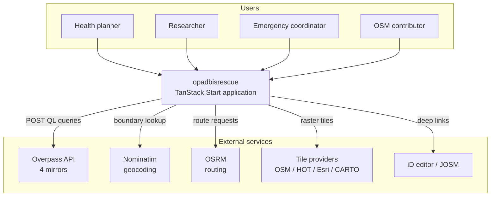
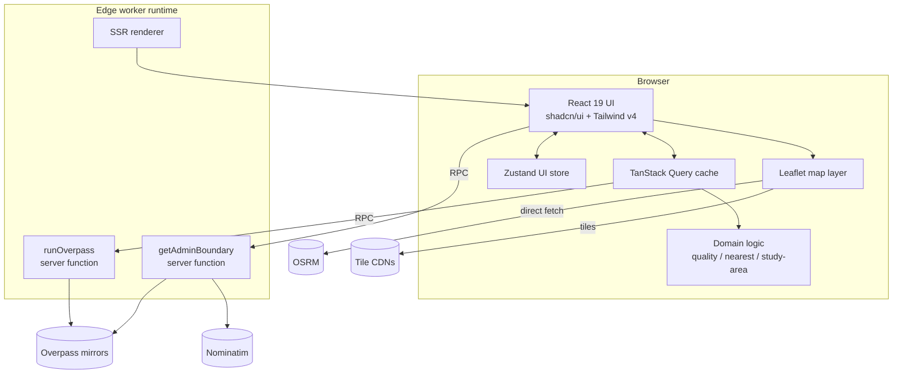
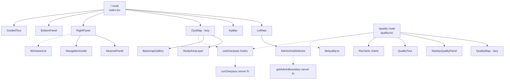
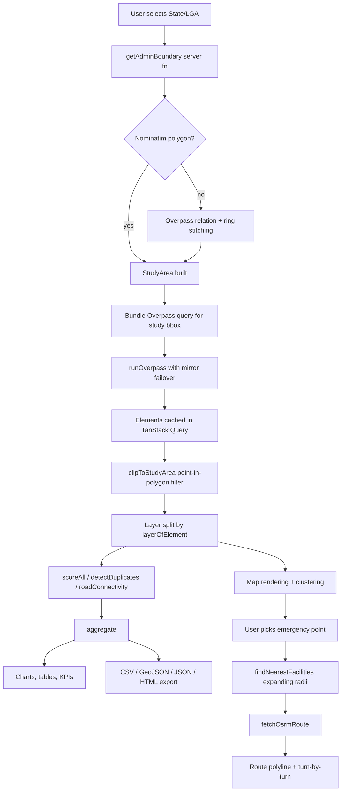
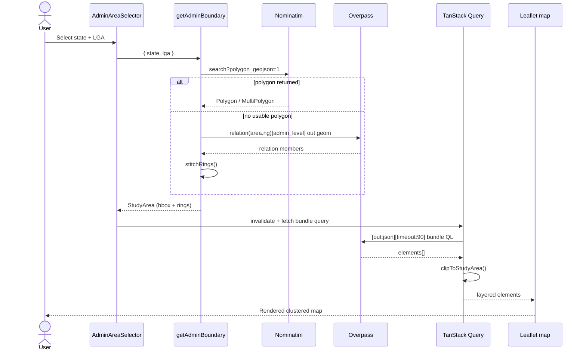
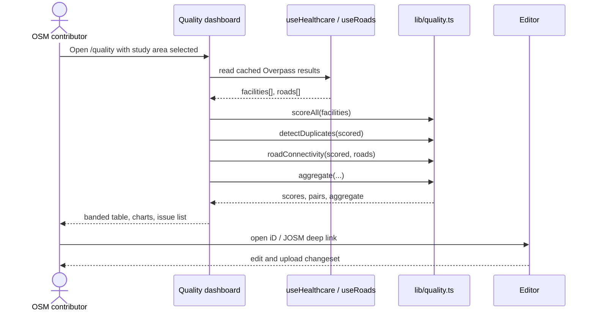
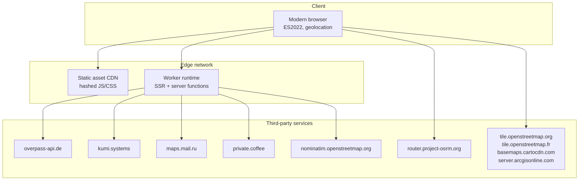

# System Architecture

[← Documentation index](../README.md#documentation)

## Table of Contents

- [Architectural principles](#architectural-principles)
- [System context diagram](#system-context-diagram)
- [Container view](#container-view)
- [Frontend architecture](#frontend-architecture)
- [Backend architecture](#backend-architecture)
- [Component diagram](#component-diagram)
- [Data flow diagram](#data-flow-diagram)
- [Sequence diagrams](#sequence-diagrams)
- [Deployment diagram](#deployment-diagram)
- [Technology selection rationale](#technology-selection-rationale)
- [Key architectural decisions](#key-architectural-decisions)

## Architectural principles

1. **Stateless by design.** No database, no session store. All state is either ephemeral UI state or a cached query result.
2. **Server layer is a proxy, not a brain.** Server functions exist to escape browser CORS/rate-limit constraints and to centralise endpoint failover; domain logic stays in pure, testable modules.
3. **Analysis on the client.** Scoring, duplicate detection and connectivity run in the browser so the deployment surface stays trivially scalable and cost-free.
4. **Fail soft.** Every external dependency has a fallback chain; a failed layer degrades that layer only.
5. **SSR-safe rendering.** Leaflet and all browser-only code is dynamically imported after hydration.

## System context diagram



## Container view



Note the asymmetry: Overpass and Nominatim traffic is proxied through server functions (rate-limit control, User-Agent policy, endpoint failover), while OSRM and tile traffic goes directly from the browser because those services are CORS-enabled and benefit from browser caching.

## Frontend architecture

```text
src/routes/index.tsx        Accessibility dashboard shell
src/routes/quality.tsx      Data quality dashboard
src/routes/__root.tsx       HTML shell, QueryClientProvider, error/404 boundaries
```

Layering:

| Layer | Modules | Responsibility |
| --- | --- | --- |
| Route shells | `src/routes/*` | Layout, head metadata, panel orchestration |
| Feature components | `src/components/gis`, `src/components/quality` | Map, panels, KPI bar, charts |
| Shared components | `src/components/shared` | Basemap gallery, admin area selector, study-area layer |
| Onboarding | `src/components/tour` | Tour engine and per-module tour scripts |
| Primitives | `src/components/ui` | shadcn/ui, unmodified where possible |
| Hooks | `src/hooks` | `useOverpass` data access, `use-hydrated`, `use-mobile` |
| Domain | `src/lib` | Pure logic: `quality`, `nearest`, `oyo`, `study-area`, `quality-export`, `basemaps`, `nigeria-admin` |
| State | `src/lib/store.ts` | Zustand store for UI/session state |

State ownership rule:

- **Zustand** owns anything the user manipulates (selection, layers, basemap, nav mode, emergency point, active route).
- **TanStack Query** owns anything fetched (Overpass results, boundaries) with a 30-minute stale time and 60-minute GC.
- **`useMemo`** owns derived analytics (scores, duplicates, aggregates) — never duplicated into state.

## Backend architecture

Two typed server functions, both thin wrappers:

| Function | File | Method | Role |
| --- | --- | --- | --- |
| `runOverpass` | `src/lib/overpass.functions.ts` | POST | Execute an Overpass QL query against four mirrors with failover |
| `getAdminBoundary` | `src/lib/admin-boundary.functions.ts` | POST | Resolve a State/LGA to a polygon via Nominatim, falling back to Overpass relation stitching |

Both validate input with Zod at the boundary. `getAdminBoundary` delegates to `admin-boundary.server.ts`, which is excluded from the client bundle by filename convention.

Runtime constraints (edge worker): no `child_process`, no native modules, no arbitrary filesystem. See [backend.md](./backend.md).

## Component diagram



## Data flow diagram



## Sequence diagrams

### Loading a study area



### Emergency navigation

```mermaid
sequenceDiagram
  actor U as User
  participant UI as NearestPanel
  participant NF as findNearestFacilities
  participant SF as runOverpass
  participant OS as OSRM
  participant M as Map

  U->>UI: Locate me / drop emergency point
  UI->>NF: (lat, lng)
  loop radii 5, 10, 25, 50 km
    NF->>SF: around:<r> healthcare query
    SF-->>NF: elements[]
    NF->>NF: classify + haversine, keep nearest per category
    Note over NF: stop early when all four categories are found
  end
  NF-->>UI: { hospital, clinic, pharmacy, ambulance }
  U->>UI: Navigate to hospital
  UI->>OS: /route/v1/driving/{from};{to}?steps=true
  OS-->>UI: geometry + legs + steps
  UI->>UI: humanise manoeuvres
  UI-->>M: polyline + turn list
```

### Quality audit



## Deployment diagram



## Technology selection rationale

| Technology | Why it was chosen | Alternatives considered |
| --- | --- | --- |
| TanStack Start v1 | SSR for fast first paint and SEO, plus typed server functions for the OSM proxy without a separate API service | Next.js (heavier, unnecessary server surface), pure SPA (CORS and rate-limit problems) |
| TanStack Router | Type-safe file-based routing that ships with Start; no runtime route table drift | React Router (no type-safe params, no loader integration here) |
| React 19 | Concurrent rendering keeps large marker sets from blocking interaction | Svelte/Vue — smaller ecosystem for the Leaflet + shadcn combination |
| TypeScript | OSM tag handling and geometry code are error-prone without strict types | Plain JS |
| Leaflet + react-leaflet | Small, raster-tile friendly, works well on low-bandwidth Nigerian connections; huge plugin ecosystem | MapLibre GL (vector tiles need hosting and more GPU; on the roadmap), OpenLayers (heavier API) |
| leaflet.markercluster | Keeps thousands of facility markers interactive | Manual grid clustering |
| TanStack Query | Caching, dedupe, retry with exponential backoff — exactly the Overpass failure profile | SWR (fewer retry controls), manual fetch |
| Zustand | Minimal boilerplate for cross-panel UI state, no context re-render cascade | Redux Toolkit (overkill), React context (re-render cost with map state) |
| Tailwind CSS v4 | Token-driven design system in one file; Lightning CSS build speed | CSS modules, styled-components |
| shadcn/ui + Radix | Accessible primitives owned in-repo, fully themeable | MUI (opinionated theme), Chakra |
| Recharts | Declarative React charts sufficient for distributions and rankings | D3 direct (more code), Chart.js (imperative) |
| Zod | Runtime validation at the server-function boundary where untrusted input arrives | io-ts, manual guards |
| Overpass API | The only practical way to query live OSM by tag and area | Planet extracts (stale, heavy), OSM API (not query-oriented) |
| Nominatim + Overpass fallback | Nominatim is fast for boundaries; Overpass relation stitching covers gaps | Geoboundaries/GADM (licensing and staleness) |
| OSRM | Free, OSM-native routing with turn-by-turn steps | GraphHopper, Valhalla (viable self-host options) |
| Vite 8 + Bun | Fast cold start and install; native TS | Webpack, npm |
| Edge worker hosting | Zero-ops, global latency, no server to patch | Node VM, container platform |

## Key architectural decisions

| ID | Decision | Rationale | Consequence |
| --- | --- | --- | --- |
| AD-1 | No database | Every dataset is public OSM and re-fetchable; persistence would add cost, ops and privacy exposure for no analytical gain | No cross-session persistence; exports are the durable artefact |
| AD-2 | Bundled Overpass query inside a study area | One 90-second request beats ten competing ones against a rate-limited mirror | Slightly slower first paint, dramatically higher success rate |
| AD-3 | Four-mirror failover with HTML sniffing | Overpass returns HTML error pages with HTTP 200 under load | Failures are retried transparently across mirrors |
| AD-4 | Client-side analytics | Keeps the server stateless and horizontally free | Large study areas are limited by browser memory |
| AD-5 | Proxy Overpass/Nominatim, direct OSRM/tiles | Matches each service's CORS posture and caching behaviour | Two distinct egress paths to document and monitor |
| AD-6 | Lazy map imports behind `useHydrated()` | Leaflet touches `window` at module scope and breaks SSR | A brief "Initializing map…" state on first render |
| AD-7 | Quantised bbox cache keys | Prevents cache misses from sub-pixel map movement | Slight over-fetch at boundaries between quantisation cells |
