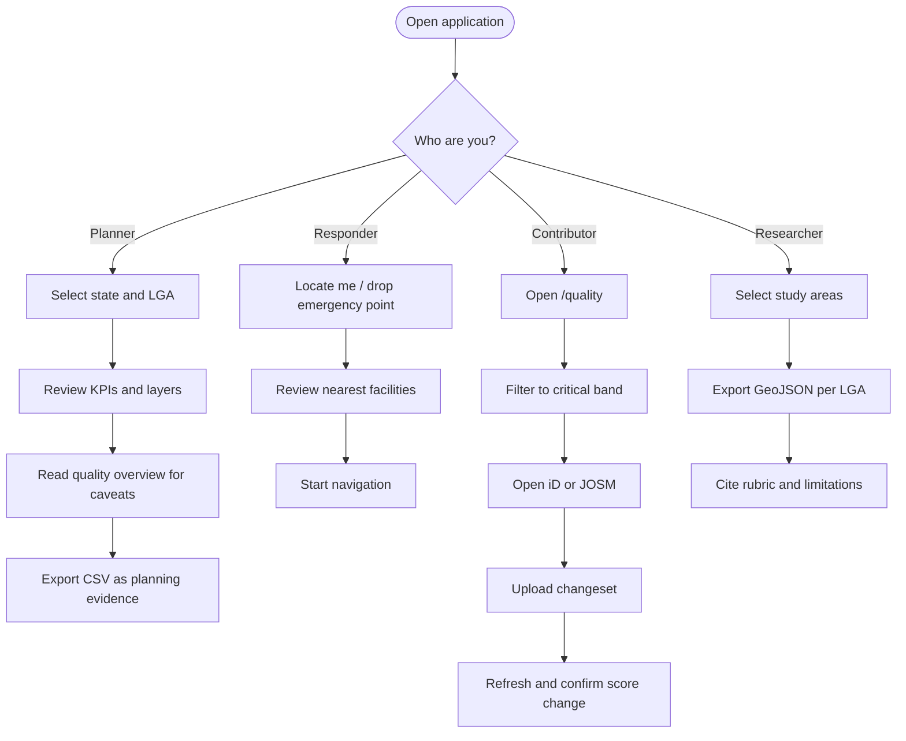

# User Roles & Personas

[← Documentation index](../README.md#documentation)

## Table of Contents

- [Current access model](#current-access-model)
- [Personas](#personas)
- [Permission matrix](#permission-matrix)
- [Persona workflows](#persona-workflows)
- [Proposed role system](#proposed-role-system)
- [Implementation notes](#implementation-notes)

## Current access model

> The application is **fully public and unauthenticated**. The roles below are *personas* — descriptions of who uses the system and why — not enforced authorisation levels. Every visitor currently has identical capabilities.

See [authentication.md](./authentication.md) for why, and for the design that would enforce roles if persistence is added.

## Personas

### Guest / general public

**Who:** Residents, journalists, students, anyone exploring health infrastructure.
**Needs:** Find nearby facilities; understand coverage in their area.
**Uses:** Interactive map, Locate Me, nearest-facility search, basic navigation.
**Does not need:** Exports, quality rubric detail, bulk analysis.

### Healthcare planner

**Who:** State ministry of health staff, LGA health officers, facility siting committees.
**Needs:** Where the gaps are, defensibly, at LGA resolution.
**Uses:** State/LGA selection, layer management, KPI bar, analytics panel, accessibility analysis, CSV export.
**Critical caveat:** Must read the quality dashboard alongside accessibility — a low facility count may be a mapping gap, not a service gap.

### Researcher / academic

**Who:** Public health, geography and development researchers.
**Needs:** Reproducible, citable, methodologically transparent data.
**Uses:** GeoJSON and CSV exports, the documented scoring rubric, per-LGA comparison.
**Critical needs:** Documented methodology (this repository), stable weights across a study period, explicit limitations.

### Government analyst

**Who:** Federal/state data units, NPHCDA analysts, emergency management agencies.
**Needs:** Cross-state comparison, data-quality assurance, briefing material.
**Uses:** Aggregate metrics, `byState` breakdown, top issues, HTML report.

### Emergency response coordinator

**Who:** Ambulance dispatchers, disaster response teams, hospital referral coordinators.
**Needs:** Fastest identification of the nearest appropriate facility and a viable route.
**Uses:** Emergency point placement, nearest-facility search, OSRM navigation, satellite verification.
**Critical caveat:** This is decision support, not a dispatch system. Durations ignore traffic and road condition.

### NGO / humanitarian field team

**Who:** MSF, Red Cross, HOT, local health NGOs.
**Needs:** Intervention targeting and offline-usable field material.
**Uses:** LGA analysis, HTML report export, humanitarian basemap, quality worklists.

### OpenStreetMap contributor

**Who:** Local mappers, HOT volunteers, mapathon participants.
**Needs:** To know what to map next and exactly what is missing.
**Uses:** Quality dashboard, band and issue filters, duplicate list, connectivity flags, iD/JOSM deep links.
**Contributes back:** Improved data that raises quality scores and accessibility accuracy for everyone.

### Developer / maintainer

**Who:** Engineers extending, deploying or forking the platform.
**Needs:** Architecture clarity, extension points, deployment procedure.
**Uses:** This documentation set, the codebase, [contributing guide](../CONTRIBUTING.md).

### Administrator (not yet implemented)

**Who:** Platform operators, once authentication exists.
**Would need:** Endpoint configuration, usage monitoring, quota management, user administration.
**Status:** No administrative interface exists; configuration is via environment variables and code.

## Permission matrix

**Current state** — every persona has identical technical access:

| Capability | Guest | Planner | Researcher | Analyst | Responder | NGO | Contributor | Developer |
| --- | --- | --- | --- | --- | --- | --- | --- | --- |
| View dashboards | ✅ | ✅ | ✅ | ✅ | ✅ | ✅ | ✅ | ✅ |
| Select state / LGA | ✅ | ✅ | ✅ | ✅ | ✅ | ✅ | ✅ | ✅ |
| Query live OSM data | ✅ | ✅ | ✅ | ✅ | ✅ | ✅ | ✅ | ✅ |
| Routing & navigation | ✅ | ✅ | ✅ | ✅ | ✅ | ✅ | ✅ | ✅ |
| Quality analysis | ✅ | ✅ | ✅ | ✅ | ✅ | ✅ | ✅ | ✅ |
| Export data | ✅ | ✅ | ✅ | ✅ | ✅ | ✅ | ✅ | ✅ |
| Editor deep links | ✅ | ✅ | ✅ | ✅ | ✅ | ✅ | ✅ | ✅ |
| Change configuration | ❌ | ❌ | ❌ | ❌ | ❌ | ❌ | ❌ | ✅¹ |

¹ Via environment variables and deployment, not through the UI.

**Primary surfaces by persona** — where each spends their time:

| Persona | Primary surface | Secondary |
| --- | --- | --- |
| Guest | Map + Locate Me | Nearest panel |
| Planner | KPI bar + analytics | CSV export, quality overview |
| Researcher | Exports | Rubric documentation |
| Analyst | Aggregates + `byState` | HTML report |
| Responder | Emergency point + navigation | Satellite basemap |
| NGO | LGA analysis | HTML report, HOT basemap |
| Contributor | Quality worklist | Duplicate and connectivity lists |
| Developer | Codebase + docs | Deployment |

## Persona workflows



## Proposed role system

Only relevant if authentication is added. Roles must be stored in a dedicated `user_roles` table and checked with a `SECURITY DEFINER` function — never on a profile row, and never in client storage.

| Role | Intended permissions |
| --- | --- |
| `viewer` (default) | Everything available publicly today |
| `contributor` | Viewer plus saved worklists and contribution tracking |
| `analyst` | Contributor plus saved workspaces, scheduled reports, historical trends |
| `admin` | Analyst plus endpoint configuration, quota management, user administration |

```sql
create type public.app_role as enum ('admin', 'analyst', 'contributor', 'viewer');
```

Guiding principle: **public capabilities must stay public.** Authentication should unlock persistence and administration, never gate the core dashboards — the public-good use case depends on frictionless access.

Full schema, RLS policies and the `has_role()` function: [authentication.md](./authentication.md#proposed-role-validation) and [database.md](./database.md#proposed-schema-if-persistence-is-added).

## Implementation notes

- Never check administrator status from `localStorage`, `sessionStorage`, a client flag, or a hardcoded email list — all are trivially forged.
- Always validate roles server-side against `user_roles` via `has_role()`.
- Grant privileges explicitly on every new public-schema table; RLS alone does not grant Data API access.
- Default new users to `viewer`; escalate deliberately.
- Audit role changes if `admin` is ever introduced.
