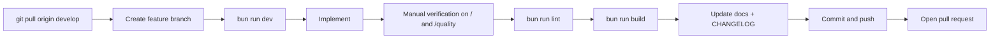
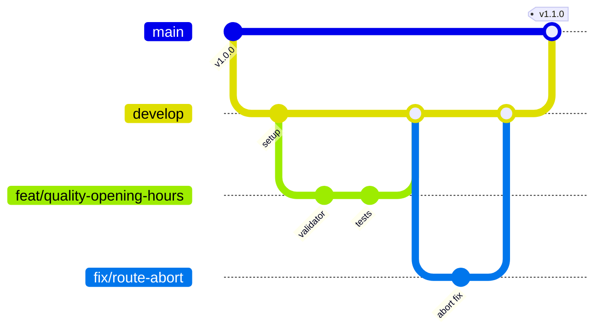
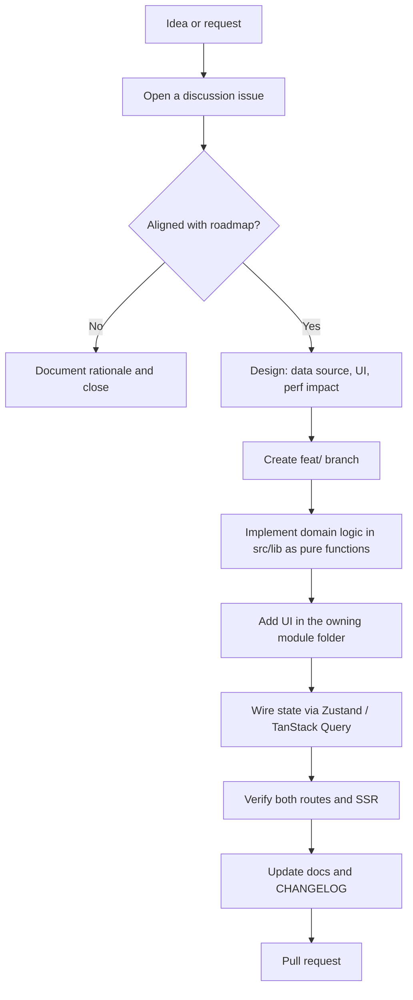
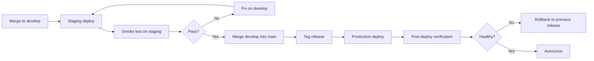
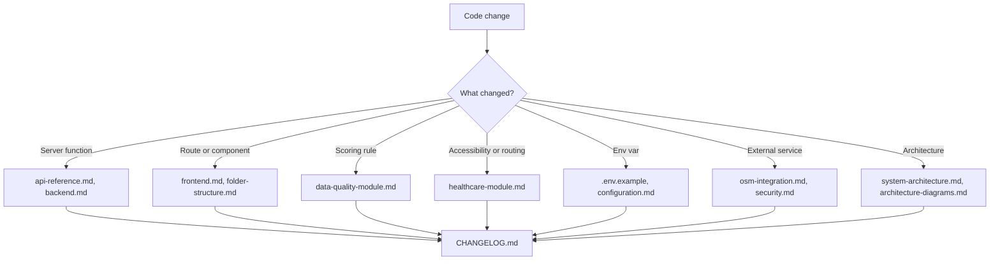

# Developer Workflow

[← Documentation index](../README.md#documentation)

## Table of Contents

- [Project setup](#project-setup)
- [Daily development workflow](#daily-development-workflow)
- [Git branching strategy](#git-branching-strategy)
- [Commit conventions](#commit-conventions)
- [Feature development](#feature-development)
- [Bug reporting and fixing](#bug-reporting-and-fixing)
- [Build process](#build-process)
- [Testing workflow](#testing-workflow)
- [Code review](#code-review)
- [Deployment workflow](#deployment-workflow)
- [Release process](#release-process)
- [Documentation update process](#documentation-update-process)
- [Dependency maintenance](#dependency-maintenance)

## Project setup

```sh
git clone <repository-url>
cd opadbisrescue
bun install
cp .env.example .env    # optional
bun run dev             # http://localhost:8080
```

Full detail: [installation.md](./installation.md).

## Daily development workflow



Guidance while developing:

- Keep the browser console open; Overpass and OSRM failures surface there first.
- Test with a real study area (Oyo → Ibadan North is a good dense example; a northern rural LGA is a good sparse one).
- Watch for rate limiting when iterating on data code — the 30-minute cache is your friend; do not disable it casually.
- Verify SSR by hard-refreshing, not only via HMR.

## Git branching strategy



| Branch | Purpose | Merges into |
| --- | --- | --- |
| `main` | Production-ready; always deployable | — |
| `develop` | Integration for the next release | `main` |
| `feat/<slug>` | New capability | `develop` |
| `fix/<slug>` | Bug fix | `develop` |
| `docs/<slug>` | Documentation only | `develop` |
| `chore/<slug>` | Tooling, dependencies, config | `develop` |
| `refactor/<slug>` | Behaviour-preserving change | `develop` |
| `hotfix/<slug>` | Urgent production fix | `main` **and** `develop` |

Rules: never commit directly to `main`; rebase on `develop` before opening a PR; one logical change per branch; delete branches after merge.

## Commit conventions

[Conventional Commits](https://www.conventionalcommits.org/):

```text
<type>(<scope>): <subject>

[optional body]
[optional footer]
```

Types: `feat`, `fix`, `docs`, `style`, `refactor`, `perf`, `test`, `build`, `ci`, `chore`, `revert`.
Scopes: `map`, `quality`, `routing`, `overpass`, `boundary`, `ui`, `docs`, `deps`, `build`.

```text
feat(quality): add opening_hours syntax validation
fix(routing): abort in-flight OSRM request when destination changes
perf(map): memoise marker cluster layer construction
docs(api): document getAdminBoundary fallback chain
```

## Feature development



Order of implementation matters: put logic in `src/lib` **first**, as pure functions, then build UI on top. It keeps the logic testable and prevents analysis rules from being buried in components.

Definition of done:

- [ ] Feature works on `/` and `/quality` as applicable.
- [ ] SSR is not broken (hard refresh, no hydration warnings).
- [ ] Lint and build pass.
- [ ] Layers respect zoom/area guards; queries are cache-keyed correctly.
- [ ] No hardcoded colour utilities.
- [ ] Documentation and `CHANGELOG.md` updated.
- [ ] Tour anchors updated if UI moved.

## Bug reporting and fixing

**Reporting** — include environment, selected state/LGA and active layers, reproduction steps, expected vs actual, console errors, failing network requests with status codes, and a screenshot.

**Triage**

| Severity | Definition | Response |
| --- | --- | --- |
| Critical | Application unusable, or dangerously wrong routing/quality output | Hotfix from `main` |
| High | A major feature is broken | Next release |
| Medium | Degraded but workaroundable | Scheduled |
| Low | Cosmetic or edge case | Backlog |

**Fixing**

1. Reproduce first — never fix from a description alone.
2. Diagnose using console, network panel and the failing status codes.
3. Fix the *category*, not the instance: if Overpass failover is wrong on one path, check every path that calls `runOverpass`.
4. Add a regression test where the logic is pure.
5. Verify the specific signal that was broken before declaring it fixed.

## Build process

| Command | Output |
| --- | --- |
| `bun run dev` | Dev server, HMR, port 8080 |
| `bun run build` | Production bundle: client assets + worker SSR bundle |
| `bun run build:dev` | Development-mode build; useful for prerender debugging |
| `bun run preview` | Serves the production build locally |
| `bun run lint` | ESLint across the repository |
| `bun run format` | Prettier write |

Build pipeline: route tree generation → TypeScript/JSX transform via Vite → Tailwind v4 (Lightning CSS) → client bundle with hashed assets → worker SSR bundle with all dependencies inlined.

Common build failures and their meaning:

| Error | Cause |
| --- | --- |
| `ReferenceError` at runtime for a helper in a `.functions.ts` file | Server-function splitting removed the runtime sibling — move helpers to a separate module |
| Build cites a `*.server` import a component never imports | A hook or util in the chain leaks server-only code into the client graph |
| `window is not defined` | A browser-only module imported at SSR module scope |
| Vite external resolution failure | `ssr.external`/`resolve.external` was set for the worker environment — remove it |

## Testing workflow

No automated test suite exists yet. The current gate is manual verification plus lint and build.

Manual regression pass before any release:

1. `/` loads; state/LGA selection resolves a boundary.
2. Layers toggle; markers cluster correctly.
3. Basemaps switch, including satellite.
4. Locate Me and manual emergency point both produce nearest results.
5. Navigation produces a route with turn-by-turn steps.
6. `/quality` scores facilities; charts render; filters work.
7. All four exports download and open correctly.
8. iD and JOSM deep links open the correct feature.
9. Hard refresh on both routes — no hydration errors.
10. Mobile viewport is usable.

The recommended automated stack and priority order: [testing.md](./testing.md).

## Code review

Reviewer checklist:

| Area | Check |
| --- | --- |
| Correctness | Does it do what the issue asked? |
| Boundaries | Domain logic pure and in `src/lib`? Server functions thin? |
| SSR | Any new browser-only import at module scope? |
| Performance | New O(n²) loops? Unmemoised heavy computation? Extra Overpass requests? |
| Caching | Query keys include the study-area/bbox identity? |
| Design system | Tokens used instead of hardcoded colours? |
| OSM etiquette | Timeouts, failover and User-Agent preserved? |
| Docs | Documentation and `CHANGELOG.md` updated? |

## Deployment workflow



Backend behaviour deploys immediately; frontend changes go live when the deployment is published. Detail: [deployment-checklist.md](./deployment-checklist.md).

## Release process

1. Confirm `develop` is green (lint, build, manual pass).
2. Move `CHANGELOG.md` entries from `Unreleased` into a new version section with a date.
3. Bump the version and choose the semver level:
   - **Major** — breaking export schema or scoring-weight changes that invalidate comparability.
   - **Minor** — new features, new checks, new layers.
   - **Patch** — bug fixes, documentation, dependency bumps.
4. Merge `develop` → `main`.
5. Tag `vX.Y.Z` and write release notes from the changelog.
6. Deploy production and run the [post-deployment verification](./deployment-checklist.md#post-deployment-verification).
7. Merge `main` back into `develop` if the release involved hotfixes.

> Changing quality weights or thresholds is a **major** change. Scores published under different weights are not comparable, and downstream research depends on that comparability.

## Documentation update process

Documentation is part of the same commit as the code it describes — never a follow-up task.



Quarterly documentation audit:

- [ ] Verify every command in `installation.md` still works from a clean clone.
- [ ] Confirm constants quoted in `configuration.md` match the source.
- [ ] Regenerate the folder tree in `folder-structure.md`.
- [ ] Check external links resolve.
- [ ] Confirm scoring tables match `src/lib/quality.ts`.
- [ ] Re-check that all Mermaid diagrams render.

## Dependency maintenance

| Cadence | Action |
| --- | --- |
| Monthly | Review security advisories; patch promptly |
| Quarterly | Minor version bumps with a full manual regression pass |
| Annually | Major framework upgrades on a dedicated branch |

Before adding any dependency: confirm it is worker-compatible (no native bindings, no node-gyp, no `child_process`), check bundle-size impact, and prefer a small pure-JS library or a few lines of local code over a large one.
